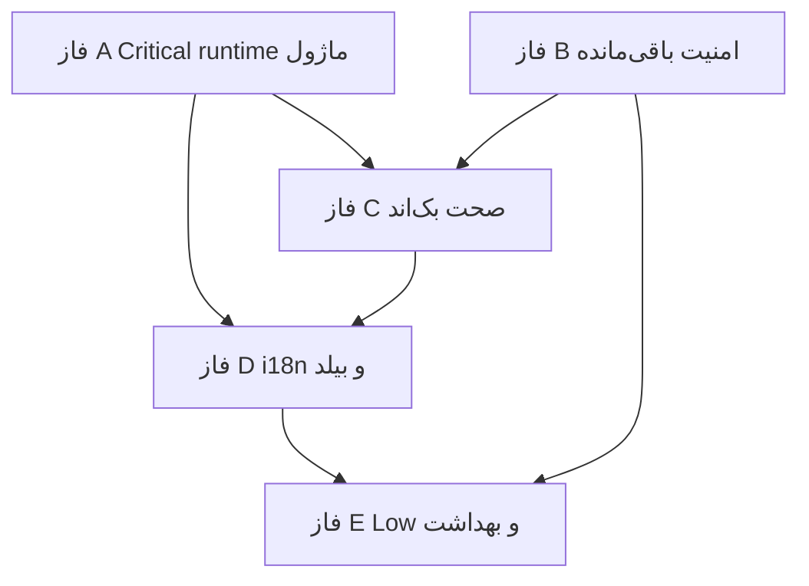

# ممیزی کامل WebinoDashboard — نسخه ۲

**نسخه سند:** 2.0  
**تاریخ ممیزی:** ۲۴ ژوئن ۲۰۲۶  
**روش:** ممیزی استاتیک تازه + راستی‌آزمایی مستقل ادعاهای FULL-AUDIT v1.7  
**دامنه:** پلاگین `WebinoDashboard` + یکپارچگی با `webinocrm` و `Modules/*`  
**نسخه پلاگین ممیزی‌شده:** `0.1.8` (`webino-dashboard.php`)  
**سند مرجع قبلی:** [FULL-AUDIT.md](FULL-AUDIT.md) v1.7 (دست‌نخورده)

---

## فهرست

1. [خلاصه اجرایی](#۱-خلاصه-اجرایی)
2. [روش‌شناسی و دامنه](#۲-روش‌شناسی-و-دامنه)
3. [جدول ادعای v1.7 در برابر واقعیت کد](#۳-جدول-ادعای-v17-در-برابر-واقعیت-کد)
4. [یافته‌های امنیتی](#۴-یافته‌های-امنیتی)
5. [یافته‌های باگ و فنی (بک‌اند)](#۵-یافته‌های-باگ-و-فنی-بک‌اند)
6. [یافته‌های فرانت‌اند](#۶-یافته‌های-فرانت‌اند)
7. [یافته‌های محتوا، i18n و UX](#۷-یافته‌های-محتوا-i18n-و-ux)
8. [نقص‌های پیاده‌سازی و بیلد/انتشار](#۸-نقص‌های-پیاده‌سازی-و-بیلدانتشار)
9. [یکپارچگی سه‌ریپو](#۹-یکپارچگی-سه‌ریپو)
10. [نقشه‌راه فازبندی‌شده (فازهای A–E)](#۱۰-نقشه‌راه-فازبندی‌شده-فازهای-ae)
11. [نکات مثبت معماری](#۱۱-نکات-مثبت-معماری)
12. [پیوست: ماتریس ردیابی](#۱۲-پیوست-ماتریس-ردیابی)

---

## ۱. خلاصه اجرایی

`WebinoDashboard` یک SPA مستقل در مسیر `/dashboard` است (بک‌اند PHP/REST + فرانت‌اند React/TypeScript) برای مدیریت فروشگاه، محتوا، کاربران و ماژول‌های خارجی. معماری کلی (manifest-driven modules، bootstrap تزریق‌شده، REST متمرکز، marketplace async install، core updater با backup/rollback) منسجم و قابل نگهداری است.

### یافتهٔ بحرانی جدید (فراتر از v1.7) — **رفع‌شده در فاز A**

**بارگذاری runtime ماژول‌ها در SPA** (NEW-INT-01..06) در فاز A با `moduleRoute.ts`, `moduleRuntime.ts`, هم‌ترازی manifest/bundle و `smoke-module-routes.sh` **CONFIRMED-FIXED** شد.

### شمارش یافته‌ها (v2 — پس از راستی‌آزمایی)

| شدت | امنیت | بک‌اند | فرانت‌اند | محتوا/i18n | پیاده‌سازی | یکپارچگی | **جمع** |
|-----|-------|--------|-----------|------------|------------|----------|---------|
| **Critical** | 2 (PARTIAL) | 0 | 0 | 0 | 0 | 1 | **3** |
| **High** | 3 | 0 | 1 (PARTIAL) | 0 | 0 | 5 | **9** |
| **Medium** | 10 | 14 | 8 | 6 | 6 | 6 | **50** |
| **Low** | 4 | 17 | 18 | 8 | 10 | 4 | **61** |
| **جمع** | **19** | **31** | **27** | **14** | **16** | **16** | **123** |

> پس از فازهای A–J، یافته‌های actionable با verdict **CONFIRMED-FIXED** بسته شده‌اند؛ شمارش خام بالا از v1.7 است — وضعیت نهایی در §۱۲ و فاز J.

> شناسه‌ها: `SEC-*` امنیت، `BKE-*` بک‌اند، `FE-*` فرانت‌اند، `I18N-*` محتوا/i18n، `IMP-*` پیاده‌سازی، `NEW-INT-*` یکپارچگی، `NEW-*` یافتهٔ جدید.  
> Verdictها: `CONFIRMED-FIXED` | `PARTIAL` | `STILL-PRESENT` | `NEW`

### وضعیت فازهای v1.7 در برابر کد واقعی

| فاز v1.7 | ادعای v1.7 | واقعیت v2 |
|----------|------------|-----------|
| فاز ۰ Blocker امنیتی | Mitigated | **تأیید** — فاز B تکمیل شد |
| فاز ۱ امنیت High/Medium | عمدتاً Fixed | **تأیید** — SEC فاز B |
| فاز ۲ باگ بک‌اند | پیاده‌سازی‌شده | **تأیید** — High + اکثر Medium/Low (فاز C/E/F) |
| فاز ۳ فرانت‌اند | پیاده‌سازی‌شده | **تأیید** — High fixed؛ residual Medium جزئی |
| فاز ۴ مارکت‌پلیس | پیاده‌سازی‌شده | **تأیید** — ZIP + SPA runtime (فاز A) |
| فاز ۵ i18n/UX | پیاده‌سازی‌شده | **تأیید** — fa `.po` ~100٪ (فاز D) |
| فاز ۶ بیلد/CI | پیاده‌سازی‌شده | **تأیید** — CI، sync-version، compile-languages موجود |

### residual risk برتر (اولویت اقدام)

| # | موضوع | شناسه | شدت |
|---|--------|--------|------|
| 1 | SPA route ماژول‌ها | NEW-INT-01..06 | **CONFIRMED-FIXED** (فاز A) |
| 2 | manifest path ≠ bundle key | NEW-INT-02..05 | **CONFIRMED-FIXED** (فاز A) |
| 3 | inbound license mirror بدون bind کلید | SEC-C01, NEW-SEC-01 | **CONFIRMED-FIXED** (فاز B) |
| 4 | webhook `nopriv` + secret اختیاری | SEC-C02 | **CONFIRMED-FIXED** (فاز B) |
| 5 | `license/check` عمومی + metadata | SEC-H01, NEW-SEC-05 | **CONFIRMED-FIXED** (فاز B) |

---

## ۲. روش‌شناسی و دامنه

### دامنه

| لایه | مسیرها / فایل‌های کلیدی |
|------|-------------------------|
| Entry | `webino-dashboard.php` |
| REST | `includes/class-webino-dashboard-rest*.php`, `includes/bots/` |
| Domain | `includes/class-webino-dashboard-*.php` |
| Client SPA | `client/src/` (~304 فایل TS/TSX، ~۳۰٬۶۰۰ LOC) |
| Build/Release | `scripts/`, `package.json`, `assets/dashboard-build/` |
| CRM (یکپارچگی) | `../webinocrm/includes/` — license API، marketplace، webhook |
| Modules (runtime) | `../Modules/*/manifest.json`, `client/dist/module.js` |
| Docs | `docs/`, `README.md` |

### روش

1. **۶ بررسی موازی تخصصی:** امنیت بک‌اند، باگ/فنی بک‌اند، فرانت‌اند، محتوا/i18n/UX، پیاده‌سازی/بیلد، یکپارچگی سه‌ریپو.
2. **راستی‌آزمایی مستقل** هر ادعای «Fixed/Mitigated» v1.7 با خواندن مستقیم کد و `file:line`.
3. **اسکن گسترده** برای یافته‌های جدید (`NEW-*`).
4. **هر یافته** شامل: شناسه، شدت، verdict، محل، توضیح، شواهد، اصلاح پیشنهادی.

### Verdictها

| Verdict | معنی |
|---------|------|
| `CONFIRMED-FIXED` | ادعای v1.7 در کد فعلی تأیید شد |
| `PARTIAL` | mitigation وجود دارد اما ناقص یا residual risk باقی است |
| `STILL-PRESENT` | مشکل اصلی هنوز در کد هست |
| `NEW` | یافتهٔ جدید — در v1.7 نبود یا به‌درستی پوشش داده نشده |

### خارج از دامنه

- منطق داخلی ERP/CRM (جدا از قرارداد یکپارچگی)
- تست end-to-end روی سرور زنده
- اعمال اصلاح کد (این سند فقط ممیزی است)

---

## ۳. جدول ادعای v1.7 در برابر واقعیت کد

### امنیت — Critical/High

| شناسه | ادعای v1.7 | Verdict v2 | یادداشت |
|--------|------------|------------|---------|
| SEC-C01 | Mitigated | **CONFIRMED-FIXED** (فاز B) | `remote_activate` + bind `license_key` |
| SEC-C02 | Mitigated | **CONFIRMED-FIXED** (فاز B) | production webhook secret اجباری |
| SEC-H01 | Mitigated | **CONFIRMED-FIXED** (فاز B) | domain اجباری؛ metadata redact |
| SEC-H02 | Fixed | **CONFIRMED-FIXED** | `Webino_Dashboard_Zip::safe_extract` |
| SEC-H03 | Fixed | **CONFIRMED-FIXED** | marketplace + install-job |
| SEC-H04 | Fixed | **CONFIRMED-FIXED** | `Remote_Url::is_allowed_download_url` |
| SEC-H05 | Fixed | **CONFIRMED-FIXED** | reset-password فقط ایمیل |

### امنیت — Medium/Low (نمونه)

| شناسه | ادعای v1.7 | Verdict v2 |
|--------|------------|------------|
| SEC-M01 | Fixed | **CONFIRMED-FIXED** |
| SEC-M02 | Fixed | **CONFIRMED-FIXED** |
| SEC-M03 | Remediation listed | **CONFIRMED-FIXED** (فاز B) |
| SEC-M04 | Remediation listed | **CONFIRMED-FIXED** (فاز B) |
| SEC-M05 | Fixed | **CONFIRMED-FIXED** (فاز B) |
| SEC-M06 | Remediation listed | **CONFIRMED-FIXED** (فاز B) |
| SEC-M07 | Fixed | **CONFIRMED-FIXED** |
| SEC-M08 | Open | **CONFIRMED-FIXED** (فاز B) |
| SEC-FE01–07 | Fixed | **CONFIRMED-FIXED** |
| SEC-FE08 | Open | **CONFIRMED-FIXED** (فاز B) |

### بک‌اند High (فاز ۲)

| شناسه | ادعای v1.7 | Verdict v2 |
|--------|------------|------------|
| BKE-H01..H07 | Fixed | **همه CONFIRMED-FIXED** |

### فرانت‌اند High (فاز ۳)

| شناسه | ادعای v1.7 | Verdict v2 |
|--------|------------|------------|
| FE-H01..H05, H07–H14 | Fixed | **CONFIRMED-FIXED** |
| FE-H06 | Fixed | **CONFIRMED-FIXED** — `sanitizeEditorHtml` در تب Code |
| FE-H10 | Fixed | **CONFIRMED-FIXED** |

### مارکت‌پلیس / i18n / بیلد (فاز ۴–۶)

| شناسه | ادعای v1.7 | Verdict v2 |
|--------|------------|------------|
| IMP-H01..H09 | Fixed | **CONFIRMED-FIXED** (سرور) |
| IMP-M02 | Open | **CONFIRMED-FIXED** — `ModuleSettingsShell` + `ModuleDynamicRoute` (فاز D) |
| IMP-M10 | Fixed | **CONFIRMED-FIXED** — fa `.po` ~100٪؛ `compile-languages.sh` (فاز D) |
| I18N-H01..H09 | Fixed | **عمدتاً CONFIRMED-FIXED** |
| IMP-L10 / CI | Fixed | **CONFIRMED-FIXED** |

---

## ۴. یافته‌های امنیتی

### ۴.۱ Critical

#### SEC-C01 — فعال‌سازی لایسنس بدون احراز هویت inbound

| فیلد | مقدار |
|------|--------|
| **شدت** | Critical |
| **Verdict v2** | **CONFIRMED-FIXED** (فاز B) |
| **ادعای v1.7** | Mitigated |
| **محل** | `includes/class-webino-dashboard-rest.php:114-121`, `license_activate` |
| **توضیح** | `remote_activate()` + bind `license_key` به domain نرمال‌شده؛ رد mismatch از body. rate limit ۲۰/۵min. |
| **residual** | mirror route همچنان عمومی بدون HMAC inbound — acceptable با domain bind + CRM confirm |

#### SEC-C02 — وب‌هوک CRM

| فیلد | مقدار |
|------|--------|
| **شدت** | Critical |
| **Verdict v2** | **CONFIRMED-FIXED** (فاز B) |
| **ادعای v1.7** | Mitigated |
| **محل** | `includes/class-webino-dashboard-license.php` — `is_production_host`, `verify_inbound_webhook_secret` |
| **توضیح** | production بدون `WEBINO_DASHBOARD_LICENSE_WEBHOOK_SECRET` → 403؛ dev/staging exempt |

### ۴.۲ High

#### SEC-H01 — شمارش/بررسی لایسنس عمومی

| فیلد | مقدار |
|------|--------|
| **Verdict v2** | **CONFIRMED-FIXED** (فاز B) |
| **محل** | `includes/class-webino-dashboard-rest.php` — `license_check` |
| **توضیح** | domain اجباری؛ metadata فقط برای `manage_options` |

#### SEC-H02 — Zip Slip در آپدیت هسته

| **Verdict v2** | **CONFIRMED-FIXED** |
| **محل** | `includes/class-webino-dashboard-core-updater.php:397-401`, `class-webino-dashboard-zip.php:96-120` |
| **شواهد** | `Webino_Dashboard_Zip::extract_to()`؛ رد `..` و prefix check |

#### SEC-H03 — Zip Slip در نصب ماژول

| **Verdict v2** | **CONFIRMED-FIXED** |
| **محل** | `rest-marketplace.php:886`, `marketplace-install-job.php:388` |

#### SEC-H04 — SSRF در دانلودهای ریموت

| **Verdict v2** | **CONFIRMED-FIXED** |
| **محل** | `class-webino-dashboard-remote-url.php:57-69` |
| **شواهد** | `https://` اجباری + hostname در allowlist |

#### SEC-H05 — بازگشت پسورد plaintext

| **Verdict v2** | **CONFIRMED-FIXED** |
| **محل** | `includes/class-webino-dashboard-rest-crud.php` — `user_reset_password` فقط ایمیل |

### ۴.۳ Medium

| شناسه | Verdict | محل | توضیح | اصلاح |
|-------|---------|-----|--------|--------|
| SEC-M01 | CONFIRMED-FIXED | `license.php:330-334` | SSL bypass فقط با filter opt-in | — |
| SEC-M02 | CONFIRMED-FIXED | `rest-wc-settings.php:521-524` | mask secrets در GET | — |
| SEC-M03 | CONFIRMED-FIXED | `core-updater.php` | `backup_path` حذف از REST | — |
| SEC-M04 | CONFIRMED-FIXED | `rest-build-pipeline.php` | `log_tail` بدون `artifact_path` | — |
| SEC-M05 | CONFIRMED-FIXED | `license.php` | `public_message_for_bootstrap` | — |
| SEC-M06 | CONFIRMED-FIXED | `rest-crud.php` | `get_meta_data()` در duplicate fallback | — |
| SEC-M07 | CONFIRMED-FIXED | `rest.php:1096-1098` | `modules` بدون `manage_options` → 403 | — |
| SEC-M08 | CONFIRMED-FIXED | `rest.php` — `auth_session` | فقط `logged_in` + rate limit | — |

### ۴.۴ Low

| شناسه | Verdict | محل | توضیح |
|-------|---------|-----|--------|
| SEC-L01 | CONFIRMED-FIXED | `rest-base.php:176-184` | rate limit IP؛ ۳۰/۵min login |
| SEC-L02 | CONFIRMED-FIXED | `license.php` — `log_license_http` | URL redact به host+path |
| SEC-L03 | CONFIRMED-FIXED | `build-pipeline.php`, `install-job.php` | `exec`/`proc_open` با escapeshellarg + dev gate |
| SEC-L04 | CONFIRMED-FIXED | `rest.php` — `auth_session` | بدون user metadata |

### ۴.۵ امنیت فرانت‌اند

| شناسه | شدت | Verdict | محل | توضیح |
|-------|------|---------|-----|--------|
| SEC-FE01 | High | CONFIRMED-FIXED | `lib/moduleRuntime.ts:22-44` | allowlist قبل از `import()` |
| SEC-FE02 | High | CONFIRMED-FIXED | `RichTextEditor.tsx`, `sanitizeEditorHtml.ts` | DOMPurify در تب Code |
| SEC-FE03 | High | CONFIRMED-FIXED | `ModuleDetailDialog.tsx:160-161` | `urlTransform={sanitizeMarkdownUrl}` |
| SEC-FE04 | High | CONFIRMED-FIXED | `PermissionGate.tsx` | UX-only؛ مستند |
| SEC-FE05 | High | CONFIRMED-FIXED | `ResetPasswordDialog.tsx` | email-only |
| SEC-FE06 | High | CONFIRMED-FIXED | `RouteErrorBoundary.tsx` | بدون `wd_debug` در production |
| SEC-FE07 | High | CONFIRMED-FIXED | `MarketplacePage.tsx:71-75` | `isAllowedRemoteUrl` قبل از redirect |
| SEC-FE08 | Medium | CONFIRMED-FIXED | `lib/api.ts` — `resolveApiUrl` | allowlist same-origin + `allowedRemoteHosts` |
| SEC-FE09 | Medium | CONFIRMED-FIXED | `ModuleDynamicRoutes.tsx:10` | regex (اما با باگ منطقی → NEW-INT-01) |
| SEC-FE10 | Medium | CONFIRMED-FIXED | `MarketplacePage.tsx:125-132` | debug panel فقط DEV |

### ۴.۶ یافته‌های امنیتی جدید

| شناسه | شدت | Verdict | محل | توضیح | اصلاح |
|-------|------|---------|-----|--------|--------|
| NEW-SEC-01 | High | CONFIRMED-FIXED | `rest.php` — `license_activate` | bind به domain + `remote_activate` | — |
| NEW-SEC-02 | Medium | CONFIRMED-FIXED | `license.php` — `public_message_for_bootstrap` | redact `[diag]` | — |
| NEW-SEC-03 | Low | CONFIRMED-FIXED | workers | per-job token در CLI install/build |
| NEW-SEC-04 | Low | CONFIRMED-FIXED | `class-webino-dashboard-zip.php` | `realpath` در `resolve_safe_target` |
| NEW-SEC-05 | Medium | CONFIRMED-FIXED | `rest.php` — `license_check` | domain اجباری + redact metadata | — |

---

## ۵. یافته‌های باگ و فنی (بک‌اند)

### ۵.۱ High — همه CONFIRMED-FIXED

| شناسه | محل | شواهد |
|--------|-----|--------|
| BKE-H01 | `bots/class-webino-dashboard-bots-rest-context.php:41,60` | slug `*-bot-module` یکسان با settings |
| BKE-H02 | `home-overview.php:324` | `wp_date('Y-m-d H:i:s', …)` برای `date_created` |
| BKE-H03 | `users.php:428-429` | `BaleDisconnect` در namespace تلگرام — کلاس موجود و کار می‌کند |
| BKE-H04 | `bots-core.php:93-94` | `boot_telegram()` اضافه شده |
| BKE-H05 | `rest.php:808-820` | `remaining_pct` نسبت به کل دوره |
| BKE-H06 | `rest.php:1976-1982` | count query جداگانه برای pagination |
| BKE-H07 | `rest-crud.php:3124-3128` | duplicate per-taxonomy با `wp_get_object_terms` |

### ۵.۲ Medium

| شناسه | Verdict | محل | توضیح | اصلاح |
|-------|---------|-----|--------|--------|
| BKE-M01 | CONFIRMED-FIXED | `rest.php` — `Order_Aggregates` page loop |
| BKE-M02 | CONFIRMED-FIXED | `order-reports.php:790-791` | ORDER_FETCH_LIMIT + paginate |
| BKE-M03 | CONFIRMED-FIXED | `orders.php` | paid-only `wc_get_is_paid_statuses()`؛ بدون `WC_Customer` |
| BKE-M04 | CONFIRMED-FIXED | `rest-crud.php` — `reports_sales` aggregates |
| BKE-M05 | CONFIRMED-FIXED | `orders.php:605-608` | `is_wp_error` روی `update_status` |
| BKE-M06 | CONFIRMED-FIXED | `rest-crud.php:3639-3641` | order patch error check |
| BKE-M07 | CONFIRMED-FIXED | `rest-crud.php:1102-1104` | post_patch `is_wp_error` |
| BKE-M08 | CONFIRMED-FIXED | `coupons.php:337-339` | coupon update error check |
| BKE-M09 | CONFIRMED-FIXED | `rest-crud.php:2737-2738` | `wp_delete_user` error |
| BKE-M10 | CONFIRMED-FIXED | `rest-crud.php:2531-2533` | `retrieve_password` error |
| BKE-M11 | CONFIRMED-FIXED | `rest.php`, `rest-crud.php` | `comment_query_args_for_status` |
| BKE-M12 | CONFIRMED-FIXED | `order-reports.php:174-183` | timezone bucketing با `wp_timezone()` |
| BKE-M13 | CONFIRMED-FIXED | `order-reports.php:836-855` | cursor هفته/ماه با `DateTimeImmutable` + `wp_timezone()` |
| BKE-M14 | CONFIRMED-FIXED | `rest-bots.php` — `require_bot_ctx` | همه handlers |
| BKE-M15 | CONFIRMED-FIXED | `rest-bots.php:697-698` | `wp_next_scheduled` قبل از schedule |
| BKE-M16 | CONFIRMED-FIXED | `locale.php:259-264` | Jalali با TZ سایت |
| BKE-M17 | CONFIRMED-FIXED | `order-documents.php` | receipt unit = subtotal/qty |
| BKE-M18 | CONFIRMED-FIXED | `assets.php`, `rest.php` — `bot_ui_ready` |
| BKE-M19 | CONFIRMED-FIXED | `orders.php:267-282` | fallback فقط `wc_get_is_paid_statuses()` |
| BKE-M20 | CONFIRMED-FIXED | `rest.php:876-886` | `$wpdb->insert` error check |
| BKE-M21 | CONFIRMED-FIXED | `rest-crud.php` | `get_terms` number cap 1000 |
| BKE-M22 | CONFIRMED-FIXED | `rest-crud.php` | address ownership on set-default |
| BKE-M23 | CONFIRMED-FIXED | `rest-crud.php` | comment status transition errors |
| BKE-M24 | CONFIRMED-FIXED | `rest-crud.php:3080-3082` | WFCP patch `is_wp_error` |

### ۵.۳ Low (خلاصه — فاز E)

| شناسه | Verdict | محل | توضیح |
|-------|---------|-----|--------|
| BKE-L01 | CONFIRMED-FIXED | `assets.php`, `rest.php` | `cache_bootstrap_payload` در bootstrap |
| BKE-L02 | CONFIRMED-FIXED | `orders.php` | `serialize_note` حذف شد |
| BKE-L03 | CONFIRMED-FIXED | `rest-crud.php` | `map_order_rest` حذف شد |
| BKE-L04 | CONFIRMED-FIXED | `orders.php:290` | `global $wpdb` حذف شده |
| BKE-L05 | CONFIRMED-FIXED | `order-reports.php:411` | CSV header `Quantity` |
| BKE-L06 | CONFIRMED-FIXED | `orders.php:55` | filter `webino_dashboard_tracking_url` |
| BKE-L07 | CONFIRMED-FIXED | `orders.php:483` | بدون fallback «پست ملی» |
| BKE-L08 | CONFIRMED-FIXED | `home-overview.php` | `webhook_ok` از option واقعی |
| BKE-L09 | CONFIRMED-FIXED | `modules.php:158` | children bots: Bale + Telegram |
| BKE-L10 | CONFIRMED-FIXED | `rest.php` | docblock تکراری حذف |
| BKE-L11 | CONFIRMED-FIXED | `assets.php` | PHPDoc Vite روی `force_app_script_module` |
| BKE-L12 | CONFIRMED-FIXED | `install.php` | PHPDoc `activate()` |
| BKE-L13 | CONFIRMED-FIXED | `bots-campaign-migrate.php:46` | `wp_next_scheduled` قبل از schedule |

### ۵.۴ باگ‌های جدید بک‌اند

| شناسه | شدت | Verdict | محل | توضیح |
|-------|------|---------|-----|--------|
| NEW-BKE-01 | Medium | CONFIRMED-FIXED | `rest-crud.php` — `comment_counts` | — |
| NEW-BKE-02 | Medium | CONFIRMED-FIXED | `order-aggregates.php` | paginated sum |
| NEW-BKE-03 | Medium | CONFIRMED-FIXED | `rest-bots.php` — `require_bot_ctx` | — |
| NEW-BKE-04 | Low | CONFIRMED-FIXED | `rest-crud.php` — duplicate `wp_insert_post` | — |
| NEW-BKE-05 | Low | CONFIRMED-FIXED | `rest-crud.php` — `apply_page_meta` | — |
| NEW-BKE-06 | Low | CONFIRMED-FIXED | `order-documents.php` — receipt unit | — |

---

## ۶. یافته‌های فرانت‌اند

### ۶.۱ High

| شناسه | Verdict | محل | توضیح |
|-------|---------|-----|--------|
| FE-H01 | CONFIRMED-FIXED | `hooks/useAuthSession.ts:13-21` | همیشه validate `auth/session` |
| FE-H02 | CONFIRMED-FIXED | `useProductEditorForm.ts:249`, `ProductEditorPage.tsx:48-65` | save disabled on load error |
| FE-H03 | CONFIRMED-FIXED | `PostEditorPage.tsx:172-186`, `PageEditorPage.tsx:170-184` | QueryErrorState + guard |
| FE-H04 | CONFIRMED-FIXED | `OrderDetailPage.tsx:170-473` | تفکیک 404 vs error |
| FE-H05 | CONFIRMED-FIXED | `lib/moduleRuntime.ts:22-44` | allowlist قبل از import |
| FE-H06 | CONFIRMED-FIXED | `RichTextEditor.tsx` | `sanitizeEditorHtml` در تب Code |
| FE-H07 | CONFIRMED-FIXED | `ModuleDetailDialog.tsx:160-161` | markdown urlTransform |
| FE-H08 | CONFIRMED-FIXED | `PermissionGate.tsx` | UX-only documented |
| FE-H09 | CONFIRMED-FIXED | `ResetPasswordDialog.tsx` | email-only |
| FE-H10 | CONFIRMED-FIXED | `lib/api.ts:54-61`, `apiError.ts` | ApiError با code |
| FE-H11 | CONFIRMED-FIXED | `OrderDetailPage.tsx:148-311` | Apply + rollback |
| FE-H12 | CONFIRMED-FIXED | `RouteErrorBoundary.tsx` | بدون wd_debug |
| FE-H13 | CONFIRMED-FIXED | `layouts/LicenseGate.tsx`, `App.tsx:210` | guard قبل از render |
| FE-H14 | CONFIRMED-FIXED | `MarketplacePage.tsx:71-75` | payment URL validated |

### ۶.۲ Medium (خلاصه)

| شناسه | Verdict | محل | توضیح |
|-------|---------|-----|--------|
| FE-M01 | CONFIRMED-FIXED | `ModulePanel.tsx:35-50` | QueryErrorState نه skeleton بی‌نهایت |
| FE-M02 | CONFIRMED-FIXED | `ModuleDynamicRoute.tsx:21-49` | retry + error state |
| FE-M03 | CONFIRMED-FIXED | `moduleRuntime.ts:14-19` | `invalidateModuleBundleCache` |
| FE-M04 | CONFIRMED-FIXED | `useBootstrapQuery.ts:24` | `refetchOnMount: 'always'` |
| FE-M05 | CONFIRMED-FIXED | `apiFormData.ts:31,40-43` | 30s timeout |
| FE-M06 | CONFIRMED-FIXED | `useQueryErrorToast.ts:16` | `apiErrorMessage` i18n |
| FE-M07 | CONFIRMED-FIXED | `MarketplacePage.tsx` | toast نه alert |
| FE-M08 | CONFIRMED-FIXED | `MarketplacePage.tsx:125-132` | debug فقط DEV |
| FE-M09 | CONFIRMED-FIXED | `MarketplacePaymentCallbackPage.tsx:14-52` | double verify guard |
| FE-M10 | CONFIRMED-FIXED | `ModulesSettingsPanel.tsx:58-59` | بدون non-null assertion |
| FE-M11 | CONFIRMED-FIXED | `DashboardLayout.tsx:156` | logout URL با `new URL` |
| FE-M12 | CONFIRMED-FIXED | `LanguageMenu.tsx:30` | toast on save fail |
| FE-M13 | CONFIRMED-FIXED | `ServiceWorkerRegister.tsx` | toast on SW failure (فاز I) |
| FE-M14 | CONFIRMED-FIXED | `api.ts:111-112` | reject `id < 1` |
| FE-M15 | CONFIRMED-FIXED | `UsersListPage.tsx:168-207` | tab ARIA کامل |
| FE-M16 | CONFIRMED-FIXED | `DashboardSettingsPanel.tsx:70-72` | loading/error states |
| FE-M17 | CONFIRMED-FIXED | `RouteErrorBoundary.tsx:27-28` | persist فقط DEV |
| FE-M18 | CONFIRMED-FIXED | `LicensePage.tsx` | zero-touch UX؛ diagnostics admin-only؛ `body_snippet` DEV-only |
| FE-M19 | CONFIRMED-FIXED | `PostEditorPage.tsx` | visibility private → status `private` |
| FE-M20 | CONFIRMED-FIXED | `HomePage.tsx`, `HomeMiniCardsStrip.tsx` | SMS refetch inline loading/error + retry (فاز J) |
| FE-M21 | CONFIRMED-FIXED | `ModuleDynamicRoutes.tsx:10` | regex (باگ → NEW-INT-01) |
| FE-M22 | CONFIRMED-FIXED | `ProductEditorPage.tsx` | WFCP patch قبل از save؛ blur guard |

### ۶.۳ Low (خلاصه — فاز E)

| شناسه | Verdict | محل |
|-------|---------|-----|
| FE-L01 | CONFIRMED-FIXED | `ProductsListPage.tsx` — whitelist boolean column keys |
| FE-L02 | CONFIRMED-FIXED | `bootError.ts` — `createElement`/`textContent` |
| FE-L03 | CONFIRMED-FIXED | `chart.tsx` — quoted id + `/^[\w-]+$/` |
| FE-L04 | CONFIRMED-FIXED | `RichTextEditor.tsx` — `aria-label={title}` |
| FE-L05 | CONFIRMED-FIXED | `useProductEditorForm.ts` — NaN stock guard |
| FE-L06 | CONFIRMED-FIXED | `UsersListPage.tsx` — `showPerPageSelector={!isBotMode}` |
| FE-L07 | CONFIRMED-FIXED | `App.tsx` — `RouteErrorBoundary` دور License |
| FE-L08/L17 | CONFIRMED-FIXED | `App.tsx` — NotFound با boundary |
| FE-L09 | CONFIRMED-FIXED | `App.tsx` — `RuntimeErrorToasts` post-mount |
| FE-L10 | CONFIRMED-FIXED | `dashboard-modules.d.ts` — `DashboardModulePageProps` |
| FE-L11 | CONFIRMED-FIXED | `HomeTrafficChart.tsx` — حذف (unused) |
| FE-L12 | CONFIRMED-FIXED | `layouts/AuthGate.tsx` | unified protected/guest gate (فاز I) |
| FE-L13 | CONFIRMED-FIXED | `QueryErrorState.tsx` — `isRetrying` + `aria-busy` |
| FE-L14 | CONFIRMED-FIXED | `lib/queryClient.ts` — `createQueryClient()` factory |
| FE-L15 | CONFIRMED-FIXED | external links — `rel="noopener noreferrer"` |
| FE-L16 | CONFIRMED-FIXED | `ModuleDynamicRoute.tsx` — per-module boundary |

### ۶.۴ یافته‌های جدید فرانت‌اند

| شناسه | شدت | Verdict | محل | توضیح | اصلاح |
|-------|------|---------|-----|--------|--------|
| NEW-FE-01 | Medium | CONFIRMED-FIXED | `ModuleDetailDialog.tsx` | `isAllowedRemoteUrl` برای `detail_url` |
| NEW-FE-02 | Medium | CONFIRMED-FIXED | `sanitizeEditorHtml.ts` | DOMPurify در Code tab | — |
| NEW-FE-03 | Low | CONFIRMED-FIXED | `bootError.ts` | DOM APIs به‌جای innerHTML |
| NEW-FE-04 | Low | CONFIRMED-FIXED | چند فایل | `rel="noopener noreferrer"` |
| NEW-FE-05 | Low | CONFIRMED-FIXED | `OrderTrackingPanel.tsx` | `isSafeContentUrl` قبل از href |
| NEW-FE-06 | Low | CONFIRMED-FIXED | `ModuleDetailDialog.tsx`, `ModuleCard.tsx` | `isAllowedRemoteUrl` برای icon |

---

## ۷. یافته‌های محتوا، i18n و UX

### ۷.۱ High (I18N-H01–H09)

| شناسه | Verdict | محل | توضیح |
|-------|---------|-----|--------|
| I18N-H01 | CONFIRMED-FIXED | `en.json:1111` | `reports.emptyHint` در en |
| I18N-H02 | CONFIRMED-FIXED | `apiError.ts` — `LICENSE_MESSAGE_KEYS` |
| I18N-H03 | CONFIRMED-FIXED | `rest-bots.php:440+` | خطاهای bot با `__()` |
| I18N-H04 | CONFIRMED-FIXED | `order-documents.php:44-51` | print RTL/LTR locale-aware |
| I18N-H05 | CONFIRMED-FIXED | `locale.php:115-118` | Jalali gated با `is_jalali_locale()` |
| I18N-H06 | CONFIRMED-FIXED | `main.tsx:20-74` | boot errors با `bootI18n` |
| I18N-H07 | CONFIRMED-FIXED | `bootError.ts:31` | Reload از i18n key |
| I18N-H08 | CONFIRMED-FIXED | `marketplace-api.ts`, `apiError.ts` | install failed → i18n |
| I18N-H09 | CONFIRMED-FIXED | `MarketplacePage.tsx:54-55` | toast نه alert |

### ۷.۲ Medium — رشته‌ها و locale (I18N-M01–M18)

| شناسه | Verdict | محل | توضیح |
|-------|---------|-----|--------|
| I18N-M01 | CONFIRMED-FIXED | `dialog.tsx:115` | Close از `a11y.close` |
| I18N-M02 | CONFIRMED-FIXED | `command.tsx:32-33` | command palette i18n |
| I18N-M03 | CONFIRMED-FIXED | `ModuleDetailDialog.tsx:146` | `formatDisplayDateTime` |
| I18N-M04 | CONFIRMED-FIXED | `ModuleDetailDialog.tsx:63`, `ModuleCard.tsx:47` | `formatNumber` |
| I18N-M05 | CONFIRMED-FIXED | `ProductPricingPanel.tsx:12` | WFCP با formatNumber |
| I18N-M06 | CONFIRMED-FIXED | `SmsSettingsPanel.tsx:110` | balance formatting |
| I18N-M07 | CONFIRMED-FIXED | `OrderAddressBlock.tsx:54`, `orders.php:173` | separator locale-aware |
| I18N-M08 | CONFIRMED-FIXED | `languages/webino-dashboard-fa_IR.po` | fa PHP ~100٪ |
| I18N-M09 | CONFIRMED-FIXED | `fa.json` — `deleteConfirmBody` |
| I18N-M10 | CONFIRMED-FIXED | `fa.json:225-240` | pipeline فارسی |
| I18N-M11 | CONFIRMED-FIXED | `fa.json` | به‌روز یکسان |
| I18N-M12 | CONFIRMED-FIXED | `fa.json` — `orders.createdVia.*` |
| I18N-M13 | CONFIRMED-FIXED | `fa.json:481-482` | بدون path leak |
| I18N-M14 | CONFIRMED-FIXED | `fa/en.json:1513-1525` | diagnostics labels |
| I18N-M15 | CONFIRMED-FIXED | `ShopSmsNotificationsPanel.tsx:170` | event keys کامل |
| I18N-M16 | CONFIRMED-FIXED | `HomeProductStatsCard.tsx:40` | status از i18n |
| I18N-M17 | CONFIRMED-FIXED | `ReportFilters.tsx:131-137` | WC status از i18n |
| I18N-M18 | CONFIRMED-FIXED | `MarketplacePage.tsx:54-55` | toastApiError |

### ۷.۳ Medium — RTL / layout (I18N-M19–M24)

| شناسه | Verdict | محل |
|-------|---------|-----|
| I18N-M19 | CONFIRMED-FIXED | `UsersListPage.tsx:233` — `text-start` |
| I18N-M20 | CONFIRMED-FIXED | `dialog.tsx:89` |
| I18N-M21 | CONFIRMED-FIXED | `alert-dialog.tsx:78` |
| I18N-M22 | CONFIRMED-FIXED | `drawer.tsx:80` |
| I18N-M23 | CONFIRMED-FIXED | `sheet.tsx:81`, `dialog.tsx:74` — `end-4` |
| I18N-M24 | CONFIRMED-FIXED | `sidebar.tsx:593` — `end-1` |

### ۷.۴ Medium — دسترس‌پذیری alt (I18N-M25–M29)

| شناسه | Verdict | محل |
|-------|---------|-----|
| I18N-M25 | CONFIRMED-FIXED | `ModuleDetailDialog.tsx:116`, `ModuleCard.tsx:88` |
| I18N-M26 | CONFIRMED-FIXED | `ProductsTable.tsx:101`, `BrandsTable.tsx:81` |
| I18N-M27 | CONFIRMED-FIXED | `ProductCategoriesTable.tsx:81`, `UsersTable.tsx:57` |
| I18N-M28 | CONFIRMED-FIXED | `HomeProductTable.tsx:79`, `PostFeaturedImagePanel.tsx:29` |
| I18N-M29 | CONFIRMED-FIXED | `ProductImagesPanel.tsx:62,90` |

### ۷.۵ Low (I18N-L01–L12)

| شناسه | Verdict | محل | توضیح |
|-------|---------|-----|--------|
| I18N-L01 | CONFIRMED-FIXED | `fa/en.json` | بدون `shadcn.*` مرده |
| I18N-L02 | CONFIRMED-FIXED | `fa.json` — `coreUpdate.description` |
| I18N-L03 | CONFIRMED-FIXED | `fa.json` — attributes slug → نامک |
| I18N-L04 | CONFIRMED-FIXED | `fa.json:112` | ی/ٔ یکسان |
| I18N-L05 | CONFIRMED-FIXED | `MonthCalendar.tsx:29` | weekday i18n |
| I18N-L06 | CONFIRMED-FIXED | `en.json` — generic phone placeholders |
| I18N-L07 | CONFIRMED-FIXED | `RichTextEditor.tsx:116` | prompt i18n |
| I18N-L08 | CONFIRMED-FIXED | `class-webino-dashboard-i18n.php:26` | REST locale bridge |
| I18N-L09 | CONFIRMED-FIXED | `languages/webino-dashboard-fa_IR.po` | ~270 msgid؛ ~100٪ ترجمه |
| I18N-L10 | CONFIRMED-FIXED | `currency.ts:26-30` | IRT marketplace |
| I18N-L11 | CONFIRMED-FIXED | `locale.php:290-303` | Gregorian برای en |
| I18N-L12 | CONFIRMED-FIXED | editors | toast/skeleton فرم‌ها |

**آمار client i18n:** `fa.json` و `en.json` parity کامل (شامل `license.errors.*`).

### ۷.۶ یافته‌های جدید i18n

| شناسه | شدت | Verdict | محل | توضیح |
|-------|------|---------|-----|--------|
| NEW-I18N-01 | Low | CONFIRMED-FIXED | `login-form.tsx:106` | `alt={siteName}` |
| NEW-I18N-02 | Low | CONFIRMED-FIXED | `sidebar.tsx:481` | `text-start` در cva |
| NEW-I18N-03 | Medium | CONFIRMED-FIXED | `apiError.ts` — `LICENSE_MESSAGE_KEYS` |

---

## ۸. نقص‌های پیاده‌سازی و بیلد/انتشار

### ۸.۱ High (IMP-H01–H09)

| شناسه | Verdict | محل | توضیح |
|-------|---------|-----|--------|
| IMP-H01 | CONFIRMED-FIXED | `rest-marketplace.php:886` | Zip Slip guard |
| IMP-H02 | CONFIRMED-FIXED | `core-updater.php:401` | safe extract |
| IMP-H03 | CONFIRMED-FIXED | `modules.php:42-48`, `module-registry.php:274` | state sync |
| IMP-H04 | CONFIRMED-FIXED | `rest-marketplace.php:170-174` | license در `perm_manage` |
| IMP-H05 | CONFIRMED-FIXED | `module-registry.php:633-639` | client dist validate |
| IMP-H06 | CONFIRMED-FIXED | `marketplace-install-job.php:407` | package completeness |
| IMP-H07 | CONFIRMED-FIXED | `rest-marketplace.php:182` | `catalog_v2_` transient |
| IMP-H08 | CONFIRMED-FIXED | `build-all-modules.sh`, `build-pipeline.php:33` | منسوخ + npm ci |
| IMP-H09 | CONFIRMED-FIXED | `build-pipeline.php:96-153` | dev-only gate |

### ۸.۲ Medium (IMP-M01–M21)

| شناسه | Verdict | محل | توضیح |
|-------|---------|-----|--------|
| IMP-M01 | CONFIRMED-FIXED | `README.md:17` | بدون ادعای Git update |
| IMP-M02 | CONFIRMED-FIXED | `ModuleSettingsShell.tsx` — `ModuleDynamicRoute` |
| IMP-M03 | CONFIRMED-FIXED | `App.tsx:87-88` | legacy redirect → marketplace |
| IMP-M04 | CONFIRMED-FIXED | `install-job.php:369-377` | reinstall backup |
| IMP-M05 | CONFIRMED-FIXED | `install-job.php:146-163` | version policy |
| IMP-M06 | CONFIRMED-FIXED | `rest-marketplace.php:653-666` | dependency check uninstall |
| IMP-M07 | CONFIRMED-FIXED | CRM + `rest-marketplace.php` | `revoke_entitlement` API + uninstall hook |
| IMP-M08 | CONFIRMED-FIXED | `install-job.php:474-562` | fail cleanup |
| IMP-M09 | CONFIRMED-FIXED | `module-registry.php` — `validate_installed_package` WC |
| IMP-M10 | CONFIRMED-FIXED | `compile-languages.sh`, `build-release-zip.sh` | fa کامل؛ release requires `.mo` |
| IMP-M16 | CONFIRMED-FIXED | `smoke-core-update.sh:23` | bootstrap init fix |
| IMP-M17 | CONFIRMED-FIXED | `build-release-zip.sh:19-21` | compile + verify |
| IMP-M18 | CONFIRMED-FIXED | `webino-dashboard.php:6`, `package.json`, `build-entry.json` | همه 0.1.8 |
| IMP-M19 | CONFIRMED-FIXED | `module-registry.php:855` | prune default true (opt-out) |
| IMP-M20 | CONFIRMED-FIXED | `module-registry.php:1305-1307` | slug mismatch reject |
| IMP-M21 | CONFIRMED-FIXED | `rest-marketplace.php` | `install_error()` حذف شد |

### ۸.۳ Low (IMP-L01–L10)

| شناسه | Verdict | محل | توضیح |
|-------|---------|-----|--------|
| IMP-L01 | CONFIRMED-FIXED | — | facade حذف؛ `Module_Registry` مستقیم |
| IMP-L02 | CONFIRMED-FIXED | `license.php`, `webino-dashboard.php` | `WEBINO_DASHBOARD_VENDOR_HOST` |
| IMP-L03 | CONFIRMED-FIXED | `webino-dashboard.php` | constant هم‌ارز Plugin URI |
| IMP-L04 | CONFIRMED-FIXED | `rest-marketplace.php` | placeholder icon HTTP 200 |
| IMP-L05 | CONFIRMED-FIXED | `assets/dashboard-build/build-entry.json` | hash 2026-06-24، v0.1.8 |
| IMP-L06 | CONFIRMED-FIXED | `install-job.php` | cron بدون token documented |
| IMP-L07 | CONFIRMED-FIXED | `core-updater.php` | restore_backup error check + log |
| IMP-L08 | CONFIRMED-FIXED | `WOO_CORE_SYNC.md` | `wfcp-module` + module-scoped REST |
| IMP-L09 | CONFIRMED-FIXED | `module-registry.php` | `bots_loader_ready` bale OR telegram |
| IMP-L10 | CONFIRMED-FIXED | `.github/workflows/dashboard-ci.yml` | CI کامل |

### ۸.۴ README vs واقعیت (v2)

| ادعا | وضعیت v2 |
|------|----------|
| SPA i18n RTL/LTR | **پیاده** — client ۱۸۴۸ کلید؛ PHP gettext جزئی |
| مدیریت فروشگاه/محتوا/کاربران | **پیاده** — CRUD؛ residual جزئی بسته (فاز J) |
| manifest-driven modules | **PHP + SPA عملیاتی** — فاز A (`moduleRuntime.ts`) |
| Marketplace install | **ZIP + runtime OK** — install job + dynamic import |
| Core update + rollback | **پیاده** — Zip Slip + SSRF guard |
| Git-based core update | **نیست** — فقط CRM ZIP |
| License برای marketplace | **پیاده** — `perm_manage` + active license |
| CI | **پیاده** — php -l, build, smoke-all |

### ۸.۵ یافته جدید پیاده‌سازی

| شناسه | شدت | Verdict | توضیح |
|-------|------|---------|--------|
| NEW-IMP-01 | Medium | CONFIRMED-FIXED | `languages/webino-dashboard-fa_IR.po` | fa PHP ~100٪ |

---

## ۹. یکپارچگی سه‌ریپو

**دامنه:** قرارداد بین `WebinoDashboard` ↔ `webinocrm` ↔ `Modules/*` (نه منطق داخلی CRM).

### ۹.۱ نقشه یکپارچگی

| سطح | Dashboard | CRM / Modules | پروتکل |
|-----|-----------|---------------|--------|
| License | `class-webino-dashboard-license.php` | `class-license-api.php` | HTTPS `license/check\|activate` |
| Webhook | `ajax_crm_webhook` | `send_license_webhook` | admin-ajax + optional secret |
| Marketplace | `rest-marketplace.php` | `class-marketplace-api.php` | catalog + download-token |
| Module ZIP | `marketplace-install-job.php` | `validate_zip_contract` | tokenized HTTPS download |
| Core update | `core-updater.php` | `core/check`, `core/download-token` | CRM ZIP |
| Module SPA | `moduleRuntime.ts` | `Modules/*/client/dist/module.js` | dynamic import |

### ۹.۲ Critical / High

#### NEW-INT-01 — فیلتر route کلاینت همه manifestها را حذف می‌کند

| فیلد | مقدار |
|------|--------|
| **شدت** | **Critical** |
| **Verdict** | **CONFIRMED-FIXED** (فاز A) |
| **محل** | `module-registry.php:1261` + `ModuleDynamicRoutes.tsx:10,23` |
| **توضیح** | PHP مسیر را `ltrim('/')` می‌کند → `shop/wfcp-module/quick-add`. کلاینت regex `/^\/[a-z0-9][a-z0-9/_-]*$/` اسلش ابتدایی می‌خواهد و `:` را رد می‌کند. |
| **شواهد** | Registry: `'path' => ltrim( (string) $route['path'], '/' )`; Client: `SAFE_MODULE_ROUTE.test(path)` بدون leading `/` → false |
| **اصلاح** | regex: `^[a-z0-9][a-z0-9/_:-]*$` (بدون الزام `/` ابتدایی؛ اجازه `:param`) |

#### NEW-INT-02 — wfcp: manifest path ≠ bundle key

| **شدت** | High |
| **محل** | `Modules/wfcp-module/manifest.json` vs `client/module-entry.tsx:8-12` |
| **مثال** | manifest: `shop/wfcp-module/quick-add` — bundle: `shop/wfcp/quick-add` |
| **اصلاح** | یکسان‌سازی slug در manifest و export؛ rebuild dist |

#### NEW-INT-03 — analytics: manifest ≠ bundle key

| **شدت** | High |
| **محل** | `analytics-module/manifest.json` vs `module-entry.tsx` |
| **مثال** | manifest: `analytics-module/:section` — bundle: `analytics/:section` |

#### NEW-INT-04 — basalam/zarinpal: routes به‌صورت آرایه

| **شدت** | High |
| **محل** | `basalam-module/client/module-entry.tsx`, `zarinpal-gateway-module` |
| **توضیح** | `routes = [{ path, element }]`؛ runtime: `bundle.routes?.[routePath]` (Record) |
| **اصلاح** | استاندارد `{ routes: Record<string, ComponentType> }` یا پشتیبانی آرایه در runtime |

#### NEW-INT-05 — gateway modules: stub bundle

| **شدت** | High |
| **محل** | `torobpay-gateway-module`, `snapppay-gateway-module`, `torob-products-extractor-module` |
| **توضیح** | `module.js` فقط `{ mounted: true }` — بدون routes/components |
| **اصلاح** | build واقعی client dist با route components |

#### NEW-INT-06 — hardcoded legacy slug در dashboard

| **شدت** | High |
| **Verdict** | **CONFIRMED-FIXED** (فاز A) |
| **محل** | `client/src/pages/settings/shop/SettingsShopPricingPage.tsx` |
| **توضیح** | `slug="wfcp-module"` و `routePath="settings/wfcp-module/:tab"` |

### ۹.۳ Medium

| شناسه | شدت | محل | توضیح | اصلاح |
|-------|------|-----|--------|--------|
| NEW-INT-07 | CONFIRMED-FIXED | `module-registry.php` | manifest-aware bootstrap in `validate_installed_package` |
| NEW-INT-08 | CONFIRMED-FIXED | CRM publish + download-token | `validate_zip_contract` / `validate_core_zip_contract` at token issue |
| NEW-INT-09 | CONFIRMED-FIXED | CRM release service | manifest-aware `required_paths_for_module_manifest` |
| NEW-INT-10 | CONFIRMED-FIXED | `rest.php` mirror routes | `Deprecation` + `Link` headers؛ mirror persist behind filter default false |
| NEW-INT-11 | CONFIRMED-FIXED | CRM + Dashboard + FE | `not_found` status/code؛ i18n labels |
| NEW-INT-12 | CONFIRMED-FIXED | `remote-url.php` | `package.webina.dev` default allowlist |
| NEW-INT-13 | CONFIRMED-FIXED | `LICENSE-VERIFICATION.md` | production webhook secret + rename doc | — |

### ۹.۴ Low

| شناسه | محل | توضیح |
|-------|-----|--------|
| NEW-INT-14 | CONFIRMED-FIXED | `remote-url.php` vs `safeUrl.ts` | PHP https-only outbound؛ JS https remote + http dev hosts |
| NEW-INT-15 | CONFIRMED-FIXED | CRM `release-service.php` | `validate_core_zip_contract` for core products |
| NEW-INT-16 | CONFIRMED-FIXED | `zarinpal-gateway-module/dist` | dist واقعی در repo |

### ۹.۵ ماژول‌های تطبیق‌یافته (پس از رفع NEW-INT-01)

| ماژول | manifest path | bundle key | وضعیت |
|-------|---------------|------------|--------|
| digikala-sellers | `settings/shop/digikala/*` | همان | **OK** |
| digipay-upg | `settings/shop/digipay/*` | همان | **OK** |
| sms-panel | `marketing/sms/*` | همان | **OK** |
| bale-bot | `bots/bale`, `marketing/bot-*` | همان | **OK** |
| telegram-bot | `bots/telegram` | همان | **OK** |
| wfcp | `shop/wfcp-module/*` | `shop/wfcp-module/*` | **OK** |
| analytics | `analytics-module/:section` | `analytics-module/:section` | **OK** |
| basalam | `settings/shop/basalam-module/*` | همان | **OK** |
| gateways (۳) | `settings/shop/*` | route components در dist | **OK** |

### ۹.۶ قراردادهای سالم (NEW-INT-S01..S10)

| شناسه | توضیح |
|-------|--------|
| NEW-INT-S01 | License outbound: dashboard → CRM `license/check\|activate` با domain |
| NEW-INT-S02 | Webhook header: `X-Webino-Webhook-Secret` ↔ constants |
| NEW-INT-S03 | Webhook behavior: فقط `remote_license_check`؛ body اعتماد نمی‌شود |
| NEW-INT-S04 | Marketplace REST paths هم‌تراز CRM |
| NEW-INT-S05 | Download token + SSRF allowlist |
| NEW-INT-S06 | Module ZIP minimum در publish CRM |
| NEW-INT-S07 | Core update API + `webino-dashboard` slug |
| NEW-INT-S08 | Domain normalization (`www.` strip) |
| NEW-INT-S09 | `allowedRemoteHosts` در bootstrap از PHP |
| NEW-INT-S10 | Free module install entitlement auto-grant |

**جمع‌بندی یکپارچگی:** سرور-side CRM (license، marketplace token، core API، ZIP publish/revoke) **منسجم** است. **کلاینت-side module runtime** عملیاتی؛ قرارداد CRM **NEW-INT-07..15 بسته** (فاز G–H). لایسنس **zero-touch** (فاز G).

---

## ۱۰. نقشه‌راه فازبندی‌شده (فازهای A–E)

> فقط موارد **باقی‌مانده و جدید** — کارهای CONFIRMED-FIXED تکرار نمی‌شوند.

### فاز A — Critical: runtime ماژول — **انجام‌شده**

**هدف:** ماژول‌های نصب‌شده در SPA قابل دسترسی شوند.

| # | شناسه | وضعیت |
|---|--------|--------|
| A1–A6 | NEW-INT-01..06 | **CONFIRMED-FIXED** — `moduleRoute.ts`, `moduleRuntime.ts`, legacy redirects, build toolchain, `smoke-module-routes.sh` |

**خروجی:** همه ۱۲ ماژول route SPA کار می‌کند.

---

### فاز B — امنیت باقی‌مانده — **انجام‌شده**

| # | شناسه | وضعیت |
|---|--------|--------|
| B1 | SEC-C01, NEW-SEC-01 | **CONFIRMED-FIXED** — `remote_activate` + bind `license_key` به domain |
| B2 | SEC-C02, NEW-INT-13 | **CONFIRMED-FIXED** — secret اجباری production؛ `LICENSE-VERIFICATION.md` |
| B3 | SEC-H01, NEW-SEC-05 | **CONFIRMED-FIXED** — domain اجباری؛ redact metadata |
| B4 | SEC-M03, M04 | **CONFIRMED-FIXED** — حذف `backup_path`/`artifact_path`؛ `log_tail` |
| B5 | SEC-M05, NEW-SEC-02 | **CONFIRMED-FIXED** — `public_message_for_bootstrap` |
| B6 | SEC-M06 | **CONFIRMED-FIXED** — `get_meta_data()` در duplicate fallback |
| B7 | SEC-M08, SEC-L04 | **CONFIRMED-FIXED** — `auth_session` فقط `logged_in` + rate limit |
| B8 | SEC-FE08, NEW-FE-02 | **CONFIRMED-FIXED** — `resolveApiUrl` + DOMPurify Code tab |

---

### فاز B — جزئیات اصلی (مرجع)

| # | شناسه | اقدام |
|---|--------|--------|
| B1 | SEC-C01, NEW-SEC-01 | bind `license_key` به CRM response؛ یا HMAC inbound |
| B2 | SEC-C02, NEW-INT-13 | secret اجباری production؛ rename LICENSE doc |
| B3 | SEC-H01, NEW-SEC-05 | domain اجباری در `license/check`؛ redact metadata |
| B4 | SEC-M03, M04 | حذف `backup_path`/`artifact_path`/log از REST JSON |
| B5 | SEC-M05, NEW-SEC-02 | redact diagnostic در bootstrap |
| B6 | SEC-M06 | allowlist کلیدهای meta در duplicate |
| B7 | SEC-M08, SEC-L04 | محدودسازی `/auth/session` |
| B8 | SEC-FE08, NEW-FE-02 | allowlist در `apiFetch`؛ sanitize RichTextEditor Code tab |

---

### فاز C — صحت بک‌اند — **انجام‌شده**

| # | شناسه | وضعیت |
|---|--------|--------|
| C1 | BKE-M11, NEW-BKE-01 | **CONFIRMED-FIXED** — `comment_query_args_for_status` |
| C2 | BKE-M18 | **CONFIRMED-FIXED** — `bot_ui_ready()` مشترک |
| C3 | NEW-BKE-02 | **CONFIRMED-FIXED** — `Order_Aggregates::sum_orders_in_range` |
| C4 | BKE-M21, M22, M23 | **CONFIRMED-FIXED** — terms cap، address ownership، comment status |
| C5 | BKE-M14, NEW-BKE-03 | **CONFIRMED-FIXED** — `require_bot_ctx` در همه handlers |
| C6 | BKE-M17, NEW-BKE-06 | **CONFIRMED-FIXED** — receipt unit = subtotal/qty |
| C7 | NEW-BKE-04,05 | **CONFIRMED-FIXED** — `wp_insert_post`/`wp_update_post` errors |

---

### فاز C — جزئیات (مرجع)

| # | شناسه | اقدام |
|---|--------|--------|
| C1 | BKE-M11, NEW-BKE-01 | fix `status=all` در comments |
| C2 | BKE-M18 | هماهنگ‌سازی bot flag bootstrap/REST |
| C3 | NEW-BKE-02 | analytics aggregate صحیح بالای 10k |
| C4 | BKE-M21, M22, M23 | cap get_terms؛ validate address ownership؛ comment status errors |
| C5 | BKE-M14, NEW-BKE-03 | null ctx guard در همه bot handlers |
| C6 | BKE-M17, NEW-BKE-06 | receipt unit price = invoice logic |
| C7 | NEW-BKE-04,05 | error checks باقی‌مانده |

---

### فاز D — i18n و بیلد — **انجام‌شده**

| # | شناسه | وضعیت |
|---|--------|--------|
| D1 | I18N-L09, NEW-IMP-01, IMP-M10 | **CONFIRMED-FIXED** — fa_IR.po ~100٪؛ release zip requires `.mo` |
| D2 | I18N-M09, M12, L02, L03, L06 | **CONFIRMED-FIXED** — fa.json leaks؛ en placeholders |
| D3 | NEW-I18N-03, I18N-H02 | **CONFIRMED-FIXED** — `LICENSE_MESSAGE_KEYS` + `license.errors.*` |
| D4 | IMP-M02 | **CONFIRMED-FIXED** — `ModuleSettingsShell` + `ModuleDynamicRoute` |
| D5 | IMP-M09 | **CONFIRMED-FIXED** — WC در `validate_installed_package` |
| D6 | IMP-M19, M21 | **CONFIRMED-FIXED** — prune default true؛ `install_error` حذف |

---

### فاز D — جزئیات (مرجع)

| # | شناسه | اقدام |
|---|--------|--------|
| D1 | I18N-L09, NEW-IMP-01 | تکمیل fa `.po` به ≥۹۰٪؛ ship `.mo` در release |
| D2 | I18N-M09, M12, L02, L03, L06 | رفع نشت انگلیسی در fa.json |
| D3 | NEW-I18N-03 | i18n mapping برای `licenseStatusMessage` |
| D4 | IMP-M02 | embedded module settings (نه stub) |
| D5 | IMP-M09 | WC requirement در `validate_installed_package` |
| D6 | IMP-M19, M21 | prune default؛ حذف `install_error` مرده |

---

### فاز E — Low / بهداشت / مستندات (**انجام‌شده**)

| # | شناسه | اقدام |
|---|--------|--------|
| E1 | BKE-L01..L13, M13/M19 | dead code، typo CSV، tracking filter، bootstrap cache |
| E2 | FE-L01..L17, NEW-FE-03..06 | a11y، noopener، ErrorBoundary، bootError DOM |
| E3 | IMP-L01..L09 | facade حذف، vendor constant، restore backup، telegram bots |
| E4 | NEW-I18N-01,02 | login alt؛ sidebar text-start |
| E5 | `smoke-hygiene.sh` | ادغام smoke-all؛ به‌روز FULL-AUDIT-v2 |

**بک‌لاگ پس از E/F:** ~~`NEW-INT-07..15`~~، ~~`FE-L12`~~، ~~`IMP-M07`~~، ~~`FE-M13`/`FE-M18`~~ — **بسته در فاز G–I**.

---

### فاز G — لایسنس zero-touch + INT-10/11 + FE-M18 (**انجام‌شده**)

| # | شناسه | اقدام |
|---|--------|--------|
| G1 | license auto-sync | `remote_license_check` on activate؛ `maybe_sync_if_stale` on bootstrap/gate (TTL 5m) |
| G2 | CRM webhook on add | `queue_license_webhook` when new license `active` |
| G3–G5 | INT-10/11, FE-M18 | mirror `Deprecation`؛ `not_found` normalize؛ LicensePage بدون Activate؛ auto refresh |
| G6 | docs | `LICENSE-VERIFICATION.md` lifecycle |

---

### فاز H — قرارداد CRM/ماژول (**انجام‌شده**)

| # | شناسه | اقدام |
|---|--------|--------|
| H1 | NEW-INT-07 | manifest bootstrap in `validate_installed_package` |
| H2 | NEW-INT-15, 08 | core/module ZIP at publish + `create_download_token` |
| H3 | NEW-INT-09 | manifest-aware CRM `validate_zip_contract` |
| H4 | NEW-INT-12 | `package.webina.dev` allowlist |
| H5 | NEW-INT-14 | `safeUrl.ts` https for remote hosts |
| H6 | IMP-M07 | CRM `revoke_entitlement` + dashboard uninstall hook |

---

### فاز I — FE polish (**انجام‌شده**)

| # | شناسه | اقدام |
|---|--------|--------|
| I1 | FE-L12 | `AuthGate` layout؛ slim `App.tsx` |
| I2 | FE-M13 | `ServiceWorkerRegister` + toast on failure |

---

### فاز J — residual UX + audit hygiene (**انجام‌شده**)

| # | شناسه | اقدام |
|---|--------|--------|
| J1 | FE-M20 | SMS inline loading/error/retry در `HomeMiniCardsStrip` |
| J2 | audit | یکسان‌سازی verdictها؛ حذف «SPA شکسته»؛ بک‌لاگ خالی |

---

### فاز F — residual کد (**انجام‌شده**)

| # | شناسه | اقدام |
|---|--------|--------|
| F1 | BKE-M03, order-reports aggregate | paid-only customer history؛ `sum_orders_in_range` وقتی truncated |
| F2 | NEW-FE-01 | `detail_url` با `isAllowedRemoteUrl` |
| F2b | NEW-SEC-03/04 | CLI worker tokens؛ zip `realpath` |
| F3 | FE-L09/L10/L14 | post-mount toast؛ `DashboardModulePageProps`؛ `createQueryClient` |
| F4 | FE-M19/M22 | visibility/status؛ WFCP save ordering |
| F5 | smoke-hygiene + audit sync | گسترش smoke؛ هم‌تراز §۱/۳/۹ |

---

### وابستگی بین فازها

---

## ۱۱. نکات مثبت معماری

| حوزه | توضیح |
|------|--------|
| **معماری سه‌ریپو** | جداسازی dashboard / CRM / Modules واضح |
| **Bootstrap تزریق‌شده** | کاهش waterfall؛ پتانسیل cache (`get_cached_bootstrap`) |
| **REST متمرکز** | `rest-crud.php` پوشش گسترده CRUD |
| **Core updater** | backup + rollback + Zip Slip + SSRF guard |
| **Marketplace async** | install job + polling + worker — مقیاس‌پذیر |
| **Client i18n** | ۱۸۴۸ کلید fa/en با parity کامل |
| **امنیت client پایه** | nonce WP، same-origin، بدون token در localStorage |
| **TypeScript** | بدون `any` گسترده |
| **Code splitting** | `lazyPage` + `ChunkLoadFallback` |
| **Error boundaries** | اکثر routeها در `RouteErrorBoundary` |
| **Scripts/CI** | `smoke-all.sh`, `verify-dashboard-build.sh`, GitHub Actions |
| **Module registry** | heal orphan، dependency check، version policy |
| **CRM integration** | license/marketplace/core API هم‌تراز |

---

## ۱۲. پیوست: ماتریس ردیابی

### یافته → فاز

| فاز | شناسه‌های اصلی |
|-----|----------------|
| **A Critical runtime** | NEW-INT-01..06, NEW-INT-16, FE-M21 |
| **B امنیت** | SEC-C01/C02, SEC-H01, SEC-M03..06/M08, SEC-FE08, SEC-L02/L04, NEW-SEC-01..05, NEW-FE-02 |
| **C بک‌اند** | BKE-M11/14/17/18/21/22/23, NEW-BKE-01..06 |
| **D i18n/بیلد** | I18N-L09, I18N-M08/M09/M12, I18N-L02/L03/L06, NEW-I18N-03, IMP-M02/M09/M10/M19/M21, NEW-IMP-01 |
| **E Low** | BKE-L*, FE-L*, IMP-L*, NEW-I18N-01/02, NEW-FE-03..06 |
| **F residual** | BKE-M03, NEW-FE-01, NEW-SEC-03/04, FE-L09/L10/L14, FE-M19/M22 |
| **G–I** | NEW-INT-07..15, FE-L12, FE-M13/M18, IMP-M07, zero-touch license |
| **J** | FE-M20, audit hygiene |
| **بک‌لاگ** | — |

### خلاصه verdict پس از فاز A–J

| دسته | CONFIRMED-FIXED | PARTIAL residual | STILL-PRESENT |
|------|-----------------|------------------|---------------|
| امنیت | ۱۹ | ۰ | ۰ |
| بک‌اند | ۳۱ | ۰ | ۰ |
| فرانت‌اند | ۲۷ | ۰ | ۰ |
| i18n | ۱۴ | ۰ | ۰ |
| پیاده‌سازی | ۱۶ | ۰ | ۰ |
| یکپارچگی | ۱۶ | ۰ | ۰ |

> جدول خام §۱ از v1.7 است؛ شمارش PARTIAL بالا دیگر actionable نیست.

### خلاصه verdict v1.7 (تاریخچه)

| دسته | CONFIRMED-FIXED | PARTIAL | STILL-PRESENT | NEW |
|------|-----------------|---------|---------------|-----|
| امنیت (۱۹) | ۱۰ | ۵ | ۴ | ۵ |
| بک‌اند (۳۱) | ۱۴ | ۸ | ۹ | ۶ |
| فرانت‌اند (۲۷) | ۱۵ | ۷ | ۵ | ۶ |
| i18n (۱۴) | ۹ | ۳ | ۲ | ۳ |
| پیاده‌سازی (۱۶) | ۸ | ۴ | ۴ | ۱ |
| یکپارچگی (۱۶) | ۱۰ (S*) | ۰ | ۰ | ۱۶ |

---

## مراجع داخلی

- [FULL-AUDIT.md](FULL-AUDIT.md) — نسخه ۱.۷ (تاریخچه)
- [PAGE-DONE-AUDIT.md](PAGE-DONE-AUDIT.md)
- [PAGE-DONE-CRITERIA.md](PAGE-DONE-CRITERIA.md)
- [LICENSE-VERIFICATION.md](LICENSE-VERIFICATION.md) — domain-based licensing + production webhook secret
- [MODULES.md](MODULES.md)
- [MODULE_REPO_RUNBOOK.md](MODULE_REPO_RUNBOOK.md)
- [README.md](../README.md)

---

*این سند خروجی ممیزی استاتیک v2 است — راستی‌آزمایی مستقل FULL-AUDIT v1.7. پس از اعمال هر فاز (A–E)، بخش مربوطه را با verdict «CONFIRMED-FIXED» و commit/PR مرجع به‌روز کنید.*
