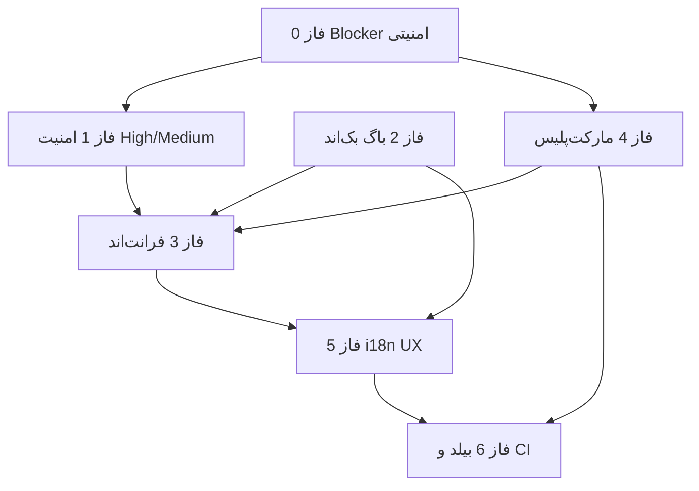

# ممیزی کامل WebinoDashboard

**نسخه سند:** 1.7  
**تاریخ ممیزی:** ۲۴ ژوئن ۲۰۲۶  
**آخرین بازبینی یکپارچگی:** ۲۴ ژوئن ۲۰۲۶ — همگام‌سازی وضعیت فاز ۰–۶ با کد  
**آخرین پیاده‌سازی امنیتی:** ۲۴ ژوئن ۲۰۲۶ — فاز ۰ و ۱  
**آخرین پیاده‌سازی بک‌اند:** ۲۴ ژوئن ۲۰۲۶ — فاز ۲ (High + Medium انتخاب‌شده)  
**آخرین پیاده‌سازی فرانت‌اند:** ۲۴ ژوئن ۲۰۲۶ — فاز ۳ (FE-H/M)  
**آخرین پیاده‌سازی مارکت‌پلیس:** ۲۴ ژوئن ۲۰۲۶ — فاز ۴ (IMP-H03–07, IMP-M03–08)  
**آخرین پیاده‌سازی i18n/UX:** ۲۴ ژوئن ۲۰۲۶ — فاز ۵ (I18N-H/M/L دامنه کامل)  
**آخرین پیاده‌سازی بیلد/انتشار:** ۲۴ ژوئن ۲۰۲۶ — فاز ۶ (pipeline، .mo، CI، PAGE-DONE فرم‌ها)  
**دامنه:** پلاگین `WebinoDashboard` — مسیر SPA `/dashboard` (بک‌اند PHP/REST + فرانت‌اند React/TypeScript)  
**نسخه پلاگین ممیزی‌شده:** `0.1.8` (`webino-dashboard.php`)

---

## فهرست

1. [خلاصه اجرایی](#۱-خلاصه-اجرایی)
2. [روش‌شناسی و دامنه](#۲-روش‌شناسی-و-دامنه)
3. [یافته‌های امنیتی](#۳-یافته‌های-امنیتی)
4. [یافته‌های باگ و فنی (بک‌اند)](#۴-یافته‌های-باگ-و-فنی-بک‌اند)
5. [یافته‌های فرانت‌اند](#۵-یافته‌های-فرانت‌اند)
6. [یافته‌های محتوا، i18n و UX](#۶-یافته‌های-محتوا-i18n-و-ux)
7. [نقص‌های پیاده‌سازی و بیلد/انتشار](#۷-نقص‌های-پیاده‌سازی-و-بیلدانتشار)
8. [نقشه‌راه فازبندی‌شده](#۸-نقشه‌راه-فازبندی‌شده)
9. [نکات مثبت معماری](#۹-نکات-مثبت-معماری)
10. [پیوست: ماتریس ردیابی یافته → فاز](#۱۰-پیوست-ماتریس-ردیابی-یافته--فاز)

---

## ۱. خلاصه اجرایی

`WebinoDashboard` یک SPA مستقل برای مدیریت فروشگاه، محتوا، کاربران و ماژول‌های خارجی است. معماری کلی (manifest-driven modules، bootstrap تزریق‌شده، REST متمرکز، marketplace async install، core updater با backup/rollback) منسجم است.

**وضعیت پس از فاز ۰–۶ (بازبینی v1.7):** یافته‌های **Critical** با mitigation عملیاتی بسته شده‌اند (تأیید CRM برای activate، webhook فقط `remote_license_check` + domain اجباری، Zip Slip guard، SSRF allowlist). **فاز ۲–۶** در کد و smoke scripts تأیید شده‌اند. **Residual:** webhook هنوز `nopriv` دارد (CRM بدون کوکی) — secret اختیاری با `WEBINO_DASHBOARD_LICENSE_WEBHOOK_SECRET`؛ inbound mirror routes بدون HMAC اختصاصی (domain + rate limit). PHP `.po` ~۲۶۶ msgid با پوشش ترجمه fa جزئی (~۴۰٪ پس از patch دسته‌ای).

### جدول شمارش شدت (اسکن اولیه — قبل از remediation)

| شدت | امنیت | بک‌اند | فرانت‌اند | محتوا/i18n | پیاده‌سازی | **جمع** |
|-----|-------|--------|-----------|------------|------------|---------|
| **Critical** | 2 | 0 | 0 | 0 | 0 | **2** |
| **High** | 5 | 7 | 14 | 9 | 9 | **44** |
| **Medium** | 8 | 15 | 22 | 28 | 21 | **94** |
| **Low** | 4 | 13 | 18 | 12 | 10 | **57** |
| **جمع** | **19** | **35** | **54** | **49** | **40** | **197** |

> شناسه‌ها: `SEC-*` امنیت، `BKE-*` بک‌اند، `FE-*` فرانت‌اند، `I18N-*` محتوا/i18n، `IMP-*` پیاده‌سازی. برای وضعیت **فعلی** هر فاز به [§۸ نقشه‌راه](#۸-نقشه‌راه-فازبندی‌شده) مراجعه کنید.

### residual risk (پس از remediation)

| # | موضوع | شناسه | وضعیت |
|---|--------|--------|--------|
| 1 | inbound license mirror بدون HMAC اختصاصی | SEC-C01 | **Mitigated** — CRM confirm + domain gate |
| 2 | webhook `nopriv` + secret اختیاری | SEC-C02 | **Mitigated** — domain اجباری؛ secret با constant/filter |
| 3 | reset-password فقط ایمیل | SEC-H05 | **Fixed** — حذف reveal/plaintext |

### وضعیت پیاده‌سازی فاز ۰ و ۱ (بازبینی v1.7)

| شناسه | وضعیت | فایل‌های کلیدی |
|--------|--------|----------------|
| SEC-C01 | **Mitigated** | `license_activate` — domain match + `remote_license_check` قبل از DB؛ بدون HMAC اختصاصی |
| SEC-C02 | **Mitigated** | `ajax_crm_webhook` — domain اجباری؛ secret اختیاری `X-Webino-Webhook-Secret`؛ `nopriv` برای CRM |
| SEC-H02/H03 | **Fixed** | `class-webino-dashboard-zip.php` + core-updater + rest-marketplace |
| SEC-H01 | **Mitigated** | `license_check` — domain mismatch → 403؛ هنوز endpoint عمومی |
| SEC-H04 | **Fixed** | `class-webino-dashboard-remote-url.php` |
| SEC-M01 | **Fixed** | `should_verify_ssl_for_base()` + فیلتر local |
| SEC-H05/FE05 | **Fixed** | `user_reset_password` فقط ایمیل؛ UI بدون reveal |
| SEC-M02 | **Fixed** | `rest-wc-settings.php` — ماسک secrets |
| SEC-M05 | **Fixed** | `transport_raw` فقط `error_log` در `WP_DEBUG` |
| SEC-M07 | **Fixed** | `settings_post` — 403 برای `modules` بدون `manage_options` |
| SEC-FE01–03,06,07 | **Fixed** | `safeUrl.ts`, `moduleRuntime.ts`, `RichTextEditor`, … |

---

## ۲. روش‌شناسی و دامنه

### دامنه

| لایه | مسیرها / فایل‌های کلیدی |
|------|-------------------------|
| Entry | `webino-dashboard.php` |
| REST | `includes/class-webino-dashboard-rest*.php`, `includes/bots/` |
| Domain | `includes/class-webino-dashboard-*.php` (orders, license, module-registry, core-updater, …) |
| Client SPA | `client/src/` (pages, components, hooks, lib, routes, layouts) |
| Build/Release | `scripts/`, `package.json`, `assets/dashboard-build/` |
| Docs | `docs/`, `README.md` |

### روش

1. **۵ بررسی تخصصی موازی:** امنیت بک‌اند، باگ/فنی بک‌اند، فرانت‌اند، محتوا/i18n/UX، نقص پیاده‌سازی/بیلد.
2. **راستی‌آزمایی دستی** یافته‌های Critical (auth bypass لایسنس، وب‌هوک، Zip Slip).
3. **مقایسه** ادعاهای `README.md` و `docs/PAGE-DONE-AUDIT.md` با کد واقعی.
4. **هر یافته** شامل: شناسه، شدت، `file:line`، توضیح، اسنیپت، اصلاح پیشنهادی.

### خارج از دامنه

- پلاگین `webinocrm` (CRM/ERP جداگانه)
- ریپوی `Modules/*` (فقط به‌عنوان وابستگی runtime)
- تست end-to-end روی سرور زنده (ممیزی استاتیک کد)

---

## ۳. یافته‌های امنیتی

### ۳.۱ Critical

#### SEC-C01 — فعال‌سازی لایسنس بدون احراز هویت

| فیلد | مقدار |
|------|--------|
| **شدت** | Critical |
| **وضعیت** | **Mitigated** (فاز ۰) |
| **محل** | `includes/class-webino-dashboard-rest.php:114-121`, `839-898` |
| **توضیح (اولیه)** | `POST .../license/activate` با `permission_callback => '__return_true'`. |
| **remediation** | `license_activate` فقط پس از `remote_license_check` موفق و تطابق domain با `home_url()` رکورد DB می‌نویسد. rate limit 20/5min. |
| **residual** | بدون HMAC/shared-secret اختصاصی روی mirror route؛ به CRM outbound متکی است. |

#### SEC-C02 — وب‌هوک CRM بدون امضا

| فیلد | مقدار |
|------|--------|
| **شدت** | Critical |
| **وضعیت** | **Mitigated** (فاز ۰ + بازبینی v1.7) |
| **محل** | `includes/class-webino-dashboard-license.php:52-53`, `113-142` |
| **توضیح (اولیه)** | `wp_ajax_nopriv_maneli_license_webhook` بدون اعتماد به body برای state. |
| **remediation** | فقط `remote_license_check` outbound؛ domain **اجباری** و باید با سایت مطابقت داشته باشد؛ rate limit؛ secret اختیاری `WEBINO_DASHBOARD_LICENSE_WEBHOOK_SECRET` + header `X-Webino-Webhook-Secret`. |
| **residual** | `nopriv` برای سازگاری CRM (admin-ajax بدون کوکی)؛ توصیه secret در production. |

### ۳.۲ High

#### SEC-H01 — شمارش/بررسی لایسنس عمومی (enumeration)

| فیلد | مقدار |
|------|--------|
| **شدت** | High |
| **محل** | `includes/class-webino-dashboard-rest.php:104-111`, `774-815` |
| **توضیح** | `POST /webinocrm/v1/license/check` عمومی است؛ افشای validity/expiry با domain+key. Rate limit 60/5min/IP ضعیف در برابر توزیع‌شده. |
| **اصلاح** | محدود به CRM با secret؛ یا فقط کد خطا بدون metadata حساس. |

#### SEC-H02 — Zip Slip در آپدیت هسته

| فیلد | مقدار |
|------|--------|
| **شدت** | High |
| **محل** | `includes/class-webino-dashboard-core-updater.php:387-394` |
| **توضیح** | `ZipArchive::extractTo($dest)` بدون اعتبارسنجی `../` یا مسیر مطلق. ZIP مخرب از CRM → نوشتن خارج از staging. |
| **اسنیپت** | `$archive->extractTo( $dest );` |
| **اصلاح** | حلقه روی `getNameIndex`؛ `realpath` داخل `$dest`؛ رد entryهای traversal. |

#### SEC-H03 — Zip Slip در نصب ماژول مارکت‌پلیس

| فیلد | مقدار |
|------|--------|
| **شدت** | High |
| **محل** | `includes/class-webino-dashboard-rest-marketplace.php:828-850` |
| **توضیح** | پیش‌اسکن فقط وجود manifest/bootstrap؛ سپس extract همه اعضا. |
| **مرتبط** | `includes/class-webino-dashboard-marketplace-install-job.php:315-316` |
| **اصلاح** | همان گارد traversal قبل از `extractTo`. |

#### SEC-H04 — SSRF در دانلودهای ریموت (URL کنترل CRM)

| فیلد | مقدار |
|------|--------|
| **شدت** | High |
| **محل** | `core-updater.php:107-115`, `marketplace-install-job.php:286-297`, `rest-marketplace.php:325-337` |
| **توضیح** | `download_url()` / `wp_remote_get()` با URL از JSON CRM بدون allowlist هاست. |
| **اصلاح** | allowlist دامنه‌های CRM/Gitea؛ pin scheme https. |

#### SEC-H05 — بازگشت پسورد plaintext در REST

| فیلد | مقدار |
|------|--------|
| **شدت** | High |
| **محل** | `includes/class-webino-dashboard-rest-crud.php:2522-2535` |
| **توضیح** | `user_reset_password` پسورد تولیدشده را در JSON برمی‌گرداند. |
| **اصلاح** | فقط ایمیل؛ یا لینک یک‌بارمصرف reset. |

### ۳.۳ Medium

| شناسه | محل | توضیح | اصلاح |
|-------|-----|--------|--------|
| SEC-M01 | `license.php:235-243,561-571` | bypass محلی با `sslverify => false` | حذف bypass یا TLS اجباری |
| SEC-M02 | `rest-wc-settings.php:470-544` | کلیدهای درگاه بدون ماسک در GET | mask secrets؛ فقط `has_value` |
| SEC-M03 | `core-updater.php:175` | `backup_path` در پاسخ REST | حذف یا محدود به لاگ ادمین |
| SEC-M04 | `rest-build-pipeline.php:116-118` | `artifact_path` و log کامل | محدودسازی فیلدها |
| SEC-M05 | `license.php:684-686,998-1001` | `transport_raw` در diagnostics | حذف از API عمومی |
| SEC-M06 | `rest-crud.php:3110-3117` | `maybe_unserialize` روی meta محصول | محدود به کلیدهای WC شناخته‌شده |
| SEC-M07 | `rest.php:154-156` | `POST /settings` با `can_read` | جدا کردن permission سطح route |
| SEC-M08 | `rest.php:74-81,699-710` | `GET /auth/session` عمومی | محدود یا حذف اطلاعات user |

### ۳.۴ Low

| شناسه | محل | توضیح |
|-------|-----|--------|
| SEC-L01 | `rest-base.php:176-184` | rate limit لاگین فقط IP؛ 30/5min |
| SEC-L02 | `license.php:499-504` | لاگ URL در `WP_DEBUG` |
| SEC-L03 | `build-pipeline.php:158-176`, `install-job.php:540-557` | `exec`/`proc_open` برای worker |
| SEC-L04 | `rest.php:74-81` | session enumeration با کوکی |

### ۳.۵ امنیت فرانت‌اند (در بخش ۵ تکرار نشده — خلاصه امنیتی)

| شناسه | شدت | محل | توضیح |
|-------|------|-----|--------|
| SEC-FE01 | High | `lib/moduleRuntime.ts:12-20` | `import(@vite-ignore entry)` بدون allowlist |
| SEC-FE02 | High | `RichTextEditor.tsx:112-128` | URL بدون اعتبارسنجی پروتکل |
| SEC-FE03 | High | `ModuleDetailDialog.tsx:159-161` | ReactMarkdown بدون `urlTransform` |
| SEC-FE04 | High | `PermissionGate.tsx:29-37` | capability فقط client-side |
| SEC-FE05 | High | `ResetPasswordDialog.tsx:37-66` | نمایش پسورد در DOM |
| SEC-FE06 | High | `RouteErrorBoundary.tsx:18-25` | `?wd_debug` در production |
| SEC-FE07 | High | `MarketplacePage.tsx:85-86` | redirect بدون validate URL |
| SEC-FE08 | Medium | `api.ts:32` | پذیرش URL مطلق در `apiFetch` |
| SEC-FE09 | Medium | `ModuleDynamicRoutes.tsx:24-27` | مسیر ماژول بدون sanitize |
| SEC-FE10 | Medium | `MarketplacePage.tsx:138-145` | پنل debug CRM در UI |

---

## ۴. یافته‌های باگ و فنی (بک‌اند)

### ۴.۱ High

#### BKE-H01 — slug اشتباه در پرمیشن REST ربات‌ها

| فیلد | مقدار |
|------|--------|
| **محل** | `includes/bots/class-webino-dashboard-rest-bots.php:252` |
| **توضیح** | `module_id` = `bale-bot`/`telegram-bot` ولی toggle در settings = `*-module`. غیرفعال‌سازی در UI REST را مسدود نمی‌کند. |
| **اصلاح** | یکسان‌سازی slug با `class-webino-dashboard-modules.php`. |

#### BKE-H02 — تاریخ نامعتبر در home overview

| فیلد | مقدار |
|------|--------|
| **محل** | `includes/class-webino-dashboard-home-overview.php:324-330` |
| **توضیح** | `date_created` با timestamp یونیکس به `wc_get_orders` — WC انتظار رشته تاریخ دارد. |
| **اصلاح** | `gmdate('Y-m-d H:i:s', $from_ts) . '...' . gmdate(...)`. |

#### BKE-H03 — disconnect تلگرام کلاس Bale را صدا می‌زند

| فیلد | مقدار |
|------|--------|
| **محل** | `includes/class-webino-dashboard-users.php:425-427` |
| **توضیح** | `BaleDisconnect` در namespace تلگرام — disconnect تلگرام همیشه fail. |
| **اصلاح** | `TelegramDisconnect` یا کلاس صحیح. |

#### BKE-H04 — موتور تلگرام boot نمی‌شود

| فیلد | مقدار |
|------|--------|
| **محل** | `includes/bots/class-webino-dashboard-bots-core.php:86-88` |
| **توضیح** | فقط `boot_bale()`؛ cron/webhook تلگرام initialize نمی‌شود. |
| **اصلاح** | افزودن `boot_telegram()` در loader. |

#### BKE-H05 — `remaining_percentage` لایسنس اشتباه

| فیلد | مقدار |
|------|--------|
| **محل** | `includes/class-webino-dashboard-rest.php:804-812` |
| **توضیح** | 50 روز باقی‌مانده → 50%؛ بدون expiry → 365 روز ثابت. |
| **اصلاح** | محاسبه نسبت به کل دوره لایسنس. |

#### BKE-H06 — pagination `found` اشتباه

| فیلد | مقدار |
|------|--------|
| **محل** | `includes/class-webino-dashboard-rest.php:1919-1928` |
| **توضیح** | fallback `found = count($items)` به‌جای total. |
| **اصلاح** | همیشه `paginate => true` یا query جداگانه count. |

#### BKE-H07 — duplicate محصول: `wp_set_object_terms` نامعتبر

| فیلد | مقدار |
|------|--------|
| **محل** | `includes/class-webino-dashboard-rest-crud.php:3119` |
| **توضیح** | taxonomy `null`؛ ادغام همه taxonomies — کپی نادرست. |
| **اصلاح** | حلقه per-taxonomy با `wp_get_object_terms`. |

### ۴.۲ Medium (خلاصه جدولی)

| شناسه | محل | توضیح |
|-------|-----|--------|
| BKE-M01 | `rest.php:919-926` | analytics `limit => -1` + N+1 |
| BKE-M02 | `order-reports.php:766-773` | گزارش سفارش بدون limit |
| BKE-M03 | `orders.php:263-277` | تاریخچه مشتری بدون limit + N+1 |
| BKE-M04 | `rest-crud.php:3751-3757` | `reports_sales` بدون limit |
| BKE-M05 | `orders.php:588-592` | `update_status` نتیجه نادیده |
| BKE-M06 | `rest-crud.php:3627-3629` | `order_patch` همان مشکل |
| BKE-M07 | `rest-crud.php:1102-1104` | `post_patch` بدون `is_wp_error` |
| BKE-M08 | `coupons.php:337` | `wp_update_post` بدون چک خطا |
| BKE-M09 | `rest-crud.php:2737` | `wp_delete_user` بدون چک |
| BKE-M10 | `rest-crud.php:2530` | `retrieve_password` بدون چک |
| BKE-M11 | `rest.php:2070-2075` | status `all` نامعتبر در `get_comments` |
| BKE-M12 | `order-reports.php:583,758-821` | timezone mismatch در bucketing |
| BKE-M13 | `order-reports.php:799-819` | هفته ISO vs گام ۷ روزه UTC |
| BKE-M14 | `rest-bots.php:358-359` | null ctx بدون guard |
| BKE-M15 | `rest-bots.php:697-698` | campaign cron duplicate |
| BKE-M16 | `locale.php:171-176` | چاپ جلالی بدون TZ سایت |
| BKE-M17 | `order-documents.php:212-213` | unit price پس از تخفیف |
| BKE-M18 | `assets.php:761-762` vs `rest.php:446-447` | flag ربات ناسازگار bootstrap/enqueue |
| BKE-M19 | `orders.php:268` | همه status در total_spent |
| BKE-M20 | `rest.php:849-856` | `$wpdb->insert` بدون چک خطا |
| BKE-M21 | `rest-crud.php:1124,1144` | `get_terms` بدون limit |
| BKE-M22 | `rest-crud.php:2720` | set default address بدون validate |
| BKE-M23 | `rest-crud.php:4024,4043` | comment patch/delete بدون چک |
| BKE-M24 | `rest-crud.php:3078` | WFCP create بدون `is_wp_error` |

### ۴.۳ Low (خلاصه)

| شناسه | محل | توضیح |
|-------|-----|--------|
| BKE-L01 | `assets.php:660-664` | `set_cached_bootstrap` هرگز صدا نمی‌شود |
| BKE-L02 | `orders.php:488-496` | `serialize_note` مرده |
| BKE-L03 | `rest-crud.php:3732-3735` | `map_order_rest` deprecated |
| BKE-L04 | `orders.php:290` | `global $wpdb` بلااستفاده |
| BKE-L05 | `order-reports.php:406` | typo header CSV `Quantity:Quantity` |
| BKE-L06 | `orders.php:55` | URL رهگیری پست ایران hardcoded |
| BKE-L07 | `orders.php:469` | برچسب پیش‌فرض «پست ملی» |
| BKE-L08 | `home-overview.php:567-568` | `webhook_ok = token_set` |
| BKE-L09 | `modules.php:152` | children خالی برای bots |
| BKE-L10 | `rest.php:692-698` | docblock تکراری |
| BKE-L11 | `assets.php:341-357` | PHPDoc ناقص |
| BKE-L12 | `install.php:17-24` | PHPDoc خالی |
| BKE-L13 | `bots-campaign-migrate.php:46` | cron duplicate با migration |

---

## ۵. یافته‌های فرانت‌اند

### ۵.۱ High

| شناسه | محل | توضیح | اصلاح |
|-------|-----|--------|--------|
| FE-H01 | `hooks/useAuthSession.ts:14-23` | bootstrap logged-in → query غیرفعال | همیشه validate `auth/session` |
| FE-H02 | `useProductEditorForm.ts:253`, `ProductEditorLayout.tsx:30` | save پس از خطای fetch | disable save on `isError` |
| FE-H03 | `PostEditorPage.tsx:173`, `PageEditorPage.tsx` | همان الگو برای نوشته/برگه | QueryErrorState + guard |
| FE-H04 | `OrderDetailPage.tsx:170-447` | خطای API = «یافت نشد» | تفکیک 404 vs error |
| FE-H05 | `lib/moduleRuntime.ts:12-20` | dynamic import بدون allowlist | allowlist origin/path |
| FE-H06 | `RichTextEditor.tsx:112-128` | XSS در link/image | validate `https:` only |
| FE-H07 | `ModuleDetailDialog.tsx:159-161` | markdown XSS | `urlTransform` |
| FE-H08 | `PermissionGate.tsx:29-37` | UI-only cap gate | document as UX only |
| FE-H09 | `ResetPasswordDialog.tsx:37-66` | پسورد در DOM | email-only flow |
| FE-H10 | `lib/api.ts:51-59` | `code` خطا از دست می‌رود | `ApiError` با code |
| FE-H11 | `OrderDetailPage.tsx:262-267` | race در status patch | debounce + rollback |
| FE-H12 | `RouteErrorBoundary.tsx:18-25` | `wd_debug` عمومی | حذف در production |
| FE-H13 | `DashboardLayout.tsx:67-83` | flash قبل از redirect license | guard قبل از render |
| FE-H14 | `MarketplacePage.tsx:85-86` | payment redirect بدون validate | allowlist URL |

### ۵.۲ Medium (خلاصه)

| شناسه | محل | توضیح |
|-------|-----|--------|
| FE-M01 | `ModulePanel.tsx:26,32` | خطا swallow → skeleton بی‌نهایت |
| FE-M02 | `ModuleDynamicRoute.tsx:30-43` | بدون retry/detail |
| FE-M03 | `moduleRuntime.ts:10-20` | cache بدون invalidation |
| FE-M04 | `useBootstrapQuery.ts:20-25` | stale capabilities/modules |
| FE-M05 | `apiFormData.ts:13` | بدون timeout |
| FE-M06 | `useQueryErrorToast.ts:11` | raw message بدون i18n |
| FE-M07 | `MarketplacePage.tsx:69,88` | `alert()` به‌جای toast |
| FE-M08 | `MarketplacePage.tsx:138` | debug panel production |
| FE-M09 | `MarketplacePaymentCallbackPage.tsx:13-39` | double verify / unmount |
| FE-M10 | `ModulesSettingsPanel.tsx:49` | non-null assertion |
| FE-M11 | `DashboardLayout.tsx:175` | logout URL بدون `/` |
| FE-M12 | `LanguageMenu.tsx:29` و مشابه | save preference silent fail |
| FE-M13 | `App.tsx:115-120` | SW register swallow |
| FE-M14 | `api.ts:100` | `id: 0` معتبر تلقی می‌شود |
| FE-M15 | `UsersListPage.tsx:168-185` | tab ARIA ناقص |
| FE-M16 | `DashboardSettingsPanel.tsx:33-113` | بدون loading/error |
| FE-M17 | `RouteErrorBoundary.tsx:33-44` | stack در sessionStorage |
| FE-M18 | `LicensePage.tsx:348-387` | diagnostics حساس |
| FE-M19 | `PostEditorPage.tsx:116-130` | private → draft ناخواسته |
| FE-M20 | `HomePage.tsx:48-54` | SMS query error نادیده |
| FE-M21 | `ModuleDynamicRoutes.tsx:24-27` | path بدون regex |
| FE-M22 | `ProductEditorPage.tsx:34-37` | WFCP blur race با save |

### ۵.۳ Low (خلاصه)

| شناسه | محل | توضیح |
|-------|-----|--------|
| FE-L01 | `ProductsListPage.tsx:95` | localStorage prefs |
| FE-L02 | `bootError.ts:8-11` | innerHTML جزئی escape |
| FE-L03 | `chart.tsx:96-98` | dangerouslySetInnerHTML theme |
| FE-L04 | `RichTextEditor.tsx:44-54` | title نه aria-label |
| FE-L05 | `useProductEditorForm.ts:185` | NaN در stock |
| FE-L06 | `UsersListPage.tsx:284` | onPerPageChange no-op |
| FE-L07 | `App.tsx:169` | License بدون ErrorBoundary |
| FE-L08 | `App.tsx:220` | NotFound بدون boundary |
| FE-L09 | `main.tsx:69-78` | rejection فقط boot |
| FE-L10 | `dashboard-modules.d.ts:3` | props ضعیف typed |
| FE-L11 | `HomeTrafficChart.tsx` | بدون virtualization |
| FE-L12 | `App.tsx:45-70` | duplicate session query |
| FE-L13 | `QueryErrorState.tsx:23` | retry بدون feedback |
| FE-L14 | `main.tsx:10-15` | QueryClient global |
| FE-L15 | `DashboardLayout.tsx:236` | rel فقط noreferrer |
| FE-L16 | `ModuleDynamicRoute.tsx:48` | بدون module boundary |
| FE-L17 | `NotFoundPage.tsx` | بدون boundary |
| FE-L18 | `index.css` | — (بدون issue) |

---

## ۶. یافته‌های محتوا، i18n و UX

### ۶.۱ High

| شناسه | محل | توضیح | اصلاح |
|-------|-----|--------|--------|
| I18N-H01 | `en.json` (missing) | `reports.emptyHint` فقط در `fa.json:1093` | افزودن به en |
| I18N-H02 | `apiError.ts:54`, `api.ts:64` | timeout انگلیسی؛ passthrough PHP | کلید i18n |
| I18N-H03 | `rest-bots.php:440+` | خطاهای فارسی hardcoded | `__()` + locale |
| I18N-H04 | `order-documents.php:72` | print همیشه RTL | locale-aware CSS |
| I18N-H05 | `locale.php:61-188` | همیشه جلالی/ارقام فارسی | gate با ui_locale |
| I18N-H06 | `main.tsx:20-77` | boot errors انگلیسی | inject locale |
| I18N-H07 | `bootError.ts:15` | «Reload page» hardcoded | i18n key |
| I18N-H08 | `marketplace-api.ts:111,121,163` | Install failed انگلیسی | apiErrorMessage |
| I18N-H09 | `MarketplacePage.tsx:89` | `alert(e.message)` | toast + i18n |

### ۶.۲ Medium — رشته‌های hardcoded و locale

| شناسه | محل | توضیح |
|-------|-----|--------|
| I18N-M01 | `dialog.tsx:115` | «Close» default |
| I18N-M02 | `command.tsx:31-32` | Command palette EN |
| I18N-M03 | `ModuleDetailDialog.tsx:39` | تاریخ FA گریگوری نه جلالی |
| I18N-M04 | `ModuleDetailDialog.tsx:66`, `ModuleCard.tsx:44` | `toLocaleString` نه `formatNumber` |
| I18N-M05 | `ProductPricingPanel.tsx:9-12` | WFCP price formatting |
| I18N-M06 | `SmsSettingsPanel.tsx:109` | balance formatting |
| I18N-M07 | `OrderAddressBlock.tsx:31`, `orders.php:173` | ویرگول فارسی `،` در EN |
| I18N-M08 | `order-documents.php:137+` | برچسب print = WP locale |
| I18N-M09 | `fa.json:910-950` | «term» انگلیسی در FA |
| I18N-M10 | `fa.json:223-284` | pipeline/dispatchers مخلوط |
| I18N-M11 | `fa.json:217,225` | به‌روز vs بروز ناسازگار |
| I18N-M12 | `en.json:1096` | «REST» در توضیح گزارش |
| I18N-M13 | `fa.json:482` | `Modules/{slug}` در خطا |
| I18N-M14 | `fa/en license.diagnostics` | برچسب vague |
| I18N-M15 | `ShopSmsNotificationsPanel.tsx:170` | fallback snake_case |
| I18N-M16 | `HomeProductStatsCard.tsx:40` | fallback status slug |
| I18N-M17 | `ReportFilters.tsx:137` | fallback WC status |
| I18N-M18 | `MarketplacePage.tsx:35` | installFailed + raw message |

### ۶.۳ Medium — RTL / layout

| شناسه | محل | توضیح |
|-------|-----|--------|
| I18N-M19 | `UsersListPage.tsx:229` | `text-left` نه `text-start` |
| I18N-M20 | `dialog.tsx:89` | `sm:text-left` |
| I18N-M21 | `alert-dialog.tsx:78` | همان |
| I18N-M22 | `drawer.tsx:80` | `md:text-left` |
| I18N-M23 | `sheet.tsx:81`, `dialog.tsx:74` | close `right-4` نه logical end |
| I18N-M24 | `sidebar.tsx:433+` | badge physical right |

### ۶.۴ Medium — دسترس‌پذیری (alt خالی)

| شناسه | محل |
|-------|-----|
| I18N-M25 | `ModuleDetailDialog.tsx:117`, `ModuleCard.tsx:83` |
| I18N-M26 | `ProductsTable.tsx:101`, `BrandsTable.tsx:81` |
| I18N-M27 | `ProductCategoriesTable.tsx:81`, `UsersTable.tsx:57` |
| I18N-M28 | `HomeProductTable.tsx:79`, `PostFeaturedImagePanel.tsx:29` |
| I18N-M29 | `ProductImagesPanel.tsx:62,90` + ۵ مورد مشابه |

### ۶.۵ Low — بهداشت locale

| شناسه | محل | توضیح |
|-------|-----|--------|
| I18N-L01 | `fa/en.json:12-16` | کلیدهای `shadcn.*` مرده |
| I18N-L02 | `fa.json:208,215` | مسیر فنی در UI |
| I18N-L03 | `fa.json:934` vs en | terminology term |
| I18N-L04 | `fa.json:108` | ی/ٔ ناسازگار |
| I18N-L05 | `MonthCalendar.tsx:10` | weekday hardcoded |
| I18N-L06 | placeholders SMS/color | `0912...`, `#ff0000` |
| I18N-L07 | `RichTextEditor.tsx:115` | `https://` در prompt |
| I18N-L08 | `i18n.php:20-25` | بدون bridge به client locale |
| I18N-L09 | `languages/*.po` | ~266 msgid PHP (extract)؛ fa ترجمه جزئی | فاز ۵/۶ — compile `.mo` |
| I18N-L10 | `currency.ts` | `IRT` در marketplace | **Fixed** فاز ۵ |
| I18N-L11 | `locale.php:296-307` | month label EN | **Fixed** فاز ۵ |
| I18N-L12 | PAGE-DONE | toast/skeleton فرم‌های ویرایش | **Fixed** فاز ۵/۶ |

---

## ۷. نقص‌های پیاده‌سازی و بیلد/انتشار

> **یادداشت v1.7:** جدول زیر یافته‌های **اسکن اولیه** را نگه می‌دارد. وضعیت remediation در [§۸](#۸-نقشه‌راه-فازبندی‌شده) خلاصه شده است.

### ۷.۱ High

| شناسه | محل | توضیح | وضعیت |
|-------|-----|--------|--------|
| IMP-H01 | `rest-marketplace.php` | Zip Slip | **Fixed** — `Webino_Dashboard_Zip::safe_extract` |
| IMP-H02 | `core-updater.php` | Zip Slip | **Fixed** |
| IMP-H03 | module state | دو state ماژول | **Fixed** فاز ۴ |
| IMP-H04 | `rest-marketplace.php` | marketplace بدون license | **Fixed** — `perm_manage` |
| IMP-H05 | module-registry | client dist validate | **Fixed** فاز ۴ |
| IMP-H06 | install-job | package completeness | **Fixed** فاز ۴ |
| IMP-H07 | transient key | `catalog_v2` | **Fixed** فاز ۴ |
| IMP-H08 | build-pipeline | `build-all-modules` منسوخ | **Fixed** فاز ۶ |
| IMP-H09 | build-pipeline | shell روی production | **Fixed** — dev-only gate |

### ۷.۲ Medium (خلاصه)

| شناسه | محل | توضیح |
|-------|-----|--------|
| IMP-M01 | `README.md:17` | Git update ادعا؛ فقط CRM ZIP |
| IMP-M02 | `ModuleSettingsShell.tsx:25-40` | settings stub |
| IMP-M03 | `App.tsx:193-203` | legacy redirect بدون module → 404 |
| IMP-M04 | `rest-marketplace.php:579+` | reinstall بدون guard/backup |
| IMP-M05 | `install-job.php:340` | بدون version policy |
| IMP-M06 | `rest-marketplace.php:633` | uninstall بدون dependency check |
| IMP-M07 | `rest-marketplace.php:633` | بدون CRM entitlement revoke |
| IMP-M08 | `install-job.php:374` | partial dir cleanup |
| IMP-M09 | `module-registry.php:278` | WC check فقط bootstrap |
| IMP-M10 | `languages/` | بدون `.mo` | **Fixed** — `compile-languages.sh` |
| IMP-M16 | `smoke-core-update.sh` | init location | **Fixed** فاز ۶ |
| IMP-M17 | `build-release-zip.sh` | script منسوخ | **Fixed** فاز ۶ |
| IMP-M18 | version sync | 0.1.8 vs 0.0.0 | **Fixed** — `sync-version.sh` |
| IMP-M01 | README | Git update ادعا | **Fixed** فاز ۶ |
| IMP-L10 | CI | بدون CI | **Fixed** — `dashboard-ci.yml` |
| IMP-M19 | `module-registry.php:587` | prune filter default false |
| IMP-M20 | `module-registry.php:722` | slug folder mismatch |
| IMP-M21 | `rest-marketplace.php:774` | `install_error` مرده |

### ۷.۳ Low

| شناسه | محل | توضیح |
|-------|-----|--------|
| IMP-L01 | `marketplace-loader.php` | deprecated facade |
| IMP-L02 | `license.php:188` | default `webina.dev` |
| IMP-L03 | `webino-dashboard.php:4,8` | URI hardcoded |
| IMP-L04 | `rest-marketplace.php:294` | icon placeholder |
| IMP-L05 | `assets/dashboard-build/` | hash قدیمی |
| IMP-L06 | `install-job.php:609` | cron بدون token (by design) |
| IMP-L07 | `core-updater.php:177` | restore failure edge case |
| IMP-L08 | `WOO_CORE_SYNC.md:16` | WFCP فقط در module |
| IMP-L09 | `module-registry.php:1149` | فقط bale در bots_loader_ready |
| IMP-L10 | — | CI | **Fixed** — GitHub Actions |

### ۷.۴ README vs واقعیت (v1.7)

| ادعا | وضعیت |
|------|--------|
| SPA i18n RTL/LTR | **پیاده** — client کامل؛ PHP gettext جزئی (~۴۰٪ fa) |
| مدیریت فروشگاه/محتوا/کاربران | **پیاده** — CRUD ناقص در برخی مسیرها (PAGE-DONE «بخشی» = scope README) |
| manifest-driven modules | **پیاده** — validation در install job |
| Marketplace install | **پیاده** — license gate + state sync |
| Core update + rollback | **پیاده** — Zip Slip guard |
| Git-based core update | **نیست** — فقط CRM ZIP |
| License برای marketplace | **پیاده** — `perm_manage` + `is_license_active` |

---

## ۸. نقشه‌راه فازبندی‌شده

### فاز ۰ — Blocker امنیتی (۱–۳ روز) ✅ Mitigated

**هدف:** بستن آسیب‌پذیری‌های قابل بهره‌برداری از راه دور.

- [x] SEC-C01: `license_activate` — domain + CRM confirm (بدون HMAC اختصاصی — residual documented)
- [x] SEC-C02: webhook — domain اجباری؛ secret اختیاری؛ `remote_license_check` only
- [x] SEC-H02, SEC-H03: `Webino_Dashboard_Zip::safe_extract()` برای core و marketplace
- [x] `scripts/smoke-license-security.sh` — static regression checks
- [ ] HMAC/shared-secret اختصاصی روی inbound mirror (اختیاری — accepted risk)

**خروجی:** patch امنیتی + smoke scripts.

---

### فاز ۱ — امنیت High/Medium (۱ هفته) ✅ عمدتاً انجام‌شده

- [x] SEC-H04: allowlist host دانلود CRM
- [x] SEC-M01: بازبینی local SSL bypass
- [x] SEC-H05 + SEC-FE05: reset-password فقط ایمیل
- [x] SEC-M02: mask gateway secrets
- [x] SEC-FE01–07: allowlist module entry، sanitize markdown/links، production hardening
- [x] SEC-M07: tighten `POST /settings` permission
- [x] SEC-M05: `transport_raw` از API عمومی حذف
- [x] SEC-H01: domain gate روی `license_check` (endpoint هنوز عمومی)

---

### فاز ۲ — باگ‌های عملکردی بک‌اند (۱–۲ هفته) ✅ پیاده‌سازی‌شده

- [x] BKE-H01: اصلاح slug ربات `*-module`
- [x] BKE-H03, BKE-H04: Telegram disconnect + boot
- [x] BKE-H02: تاریخ overview
- [x] BKE-H05, BKE-H06, BKE-H07: license %, pagination, duplicate
- [x] BKE-M01–04: pagination/limit روی analytics و گزارش‌ها
- [x] BKE-M05–10: error handling یکپارچه (`is_wp_error`)
- [x] BKE-M12–13: timezone bucketing گزارش سفارش
- [x] BKE-M17: unit price در فاکتور چاپی

---

### فاز ۳ — قابلیت اطمینان فرانت‌اند (۱–۲ هفته) ✅ پیاده‌سازی‌شده

- [x] FE-H01: همیشه validate session (`useAuthSession` + `isFetched`)
- [x] FE-H02–04: guard ادیتورها و OrderDetail error states (`QueryErrorState`, `ApiError` 404)
- [x] FE-H10, FE-M06: `ApiError` class + `apiErrorMessage` در toastها و `useQueryErrorToast`
- [x] FE-M01–03: ModulePanel/DynamicRoute error + `invalidateModuleBundleCache` + path regex
- [x] FE-H13: `LicenseGate` قبل از render داشبورد
- [x] FE-M07–08: `alert` → toast؛ debug panel فقط DEV (قبلاً)
- [x] FE-M11: logout URL با `new URL('login', baseUrl)`
- [x] FE-H05–07, H12, H14, H09: امنیت فرانت (فاز ۱) — بدون تغییر اضافه
- [x] FE-H11: وضعیت سفارش با دکمه Apply + rollback در خطا
- [x] FE-M04–05, M09–M18, M20–M22: bootstrap refetch، timeout form-data، payment callback guard، settings loading/error، و سایر UX جزئی

---

### فاز ۴ — مارکت‌پلیس و ماژول‌ها (۲ هفته) ✅ پیاده‌سازی‌شده

- [x] IMP-H03: unify `webino_dashboard_module_*` و `marketplace_*` (sync sidebar toggle + `is_module_enabled` delegation)
- [x] IMP-H04: license check در `perm_manage`
- [x] IMP-H05–06: validation کامل ZIP (client dist + bootstrap includes در `module_package_is_complete` / install job)
- [x] IMP-M04–08: reinstall backup، version policy، dependency check uninstall، fail cleanup، `webino_dashboard_module_uninstalled` hook (M07: hook-only؛ CRM revoke در webinocrm)
- [x] IMP-H07: fix catalog transient key (`catalog_v2_`)
- [x] IMP-M03: legacy routes graceful fallback (`installedModuleSlugs` + `LegacyModuleRedirect`)

---

### فاز ۵ — محتوا، i18n، RTL، a11y (۱–۲ هفته) ✅ پیاده‌سازی‌شده

- [x] I18N-H01: `reports.emptyHint` در en.json
- [x] I18N-H02–09: boot/marketplace/api errors → i18n (`bootError.ts`, `apiError.ts`, `marketplace-api.ts`, marketplace pages)
- [x] I18N-H03–05, L08, L11: `Webino_Dashboard_I18n` REST locale bridge؛ `locale.php` gating؛ print LTR/Gregorian برای en
- [x] I18N-M03–06: `formatNumber`/`formatDisplayDateTime` در marketplace، SMS، pricing
- [x] I18N-M07–08: جداکننده آدرس locale-aware (PHP + `OrderAddressBlock`)
- [x] I18N-M19–24: `text-start`، logical `end-*` در dialog/sheet/sidebar/drawer
- [x] I18N-M25–29: meaningful `alt` text (۱۶ محل)
- [x] I18N-M09–14, M15–17: پاکسازی fa/en.json terminology و fallbacks
- [x] I18N-L01–07, L10: حذف shadcn؛ placeholders؛ `formatMarketplaceCurrency`؛ weekday i18n
- [x] I18N-L09: PHP extract ~266 msgid + `.mo` compile؛ fa ترجمه دسته‌ای marketplace/license/build
- [x] I18N-L12 (PAGE-DONE toast/skeleton فرم‌ها) — نوشته/برگه/محصول/کاربر جدید

---

### فاز ۶ — بیلد، انتشار، تست، مستندات (۱ هفته) ✅ پیاده‌سازی‌شده

- [x] IMP-H08–09: build pipeline — حذف `build-all-modules`، گام `npm ci`، dev-only gate
- [x] IMP-M10: `compile-languages.sh` + ship `languages/*.mo` در release zip
- [x] IMP-M18: `sync-version.sh` + `pluginVersion` در `build-entry.json`
- [x] IMP-M16–17: `smoke-core-update` bootstrap fix؛ `build-release-zip` پیام build
- [x] IMP-L10: `.github/workflows/dashboard-ci.yml`
- [x] README: حذف ادعای Git update؛ مستند license webhook و flow انتشار
- [x] PAGE-DONE: toast/skeleton فرم‌های ویرایش (Post/Page/Product editors)
- [x] `scripts/smoke-all.sh` + `smoke-license-security.sh`

---

### فاز ۶+ — بازبینی یکپارچگی (v1.7) ✅

- [x] FULL-AUDIT v1.7 — همگام‌سازی §۱/§۳/§۷/§۸/§۹
- [x] webhook domain اجباری + secret اختیاری
- [x] reset-password email-only
- [x] CI: `smoke-all.sh` در workflow

---

## ۹. نکات مثبت معماری

| حوزه | توضیح |
|------|--------|
| **معماری سه‌ریپو** | جداسازی runtime dashboard از CRM و Modules واضح و قابل نگهداری است. |
| **Bootstrap تزریق‌شده** | کاهش waterfall اولیه؛ `get_cached_bootstrap` پتانسیل cache دارد. |
| **REST متمرکز** | `rest-crud.php` پوشش گسترده CRUD؛ اکثر مسیرها `is_wp_error` دارند. |
| **Core updater** | backup + rollback + validate package + Zip Slip guard (`Webino_Dashboard_Zip`) |
| **Marketplace async** | install job + polling + worker token — مقیاس‌پذیر برای ZIP بزرگ. |
| **Client i18n** | ~1820 کلید fa/en با parity بالا؛ `faDigits` postProcessor. |
| **امنیت client پایه** | nonce WP، `same-origin` credentials، بدون token در localStorage، بدون eval. |
| **TypeScript** | بدون `any` گسترده در `src/`. |
| **Code splitting** | `lazyPage` + `ChunkLoadFallback`. |
| **SEO SPA** | `dashboard-seo.ts` با `textContent` برای JSON-LD. |
| **Error boundaries** | اکثر routeها در `RouteErrorBoundary`. |
| **Scripts** | `verify-dashboard-build.sh`، `smoke-all.sh`، `smoke-license-security.sh` |
| **Module registry** | `heal_orphan_module_options`، dependency check در bootstrap. |

---

## ۱۰. پیوست: ماتریس ردیابی یافته → فاز

| فاز | شناسه‌های اصلی |
|-----|----------------|
| **۰ Blocker** | SEC-C01, SEC-C02, SEC-H02, SEC-H03 |
| **۱ امنیت** | SEC-H01, SEC-H04–05, SEC-M01–08, SEC-FE01–10, SEC-L01–04 |
| **۲ بک‌اند** | BKE-H01–07, BKE-M01–24, BKE-L01–13 |
| **۳ فرانت‌اند** | FE-H01–14, FE-M01–22, FE-L01–18 |
| **۴ مارکت‌پلیس** | IMP-H03–09, IMP-M01–09, IMP-M19–21 |
| **۵ i18n/UX** | I18N-H01–09, I18N-M01–29, I18N-L01–12 |
| **۶ بیلد/Docs** | IMP-H08–09, IMP-M10–18, IMP-L01–10, PAGE-DONE gaps |

### وابستگی بین فازها

---

## مراجع داخلی

- [PAGE-DONE-CRITERIA.md](PAGE-DONE-CRITERIA.md)
- [PAGE-DONE-AUDIT.md](PAGE-DONE-AUDIT.md)
- [MODULES.md](MODULES.md)
- [LICENSE-VERIFICATION.md](LICENSE-VERIFICATION.md)
- [MODULE_REPO_RUNBOOK.md](MODULE_REPO_RUNBOOK.md)

---

*این سند خروجی ممیزی استاتیک است. پس از اعمال هر فاز، بخش مربوطه را با وضعیت «رفع‌شده» و commit/PR مرجع به‌روز کنید.*
